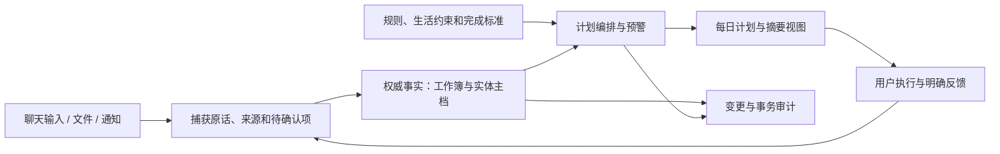

**Y2S1 文档系统阅读报告 · 2026-09-14**

本轮目标是读取 `D:\Y2S1`，理解其作为个人资料、事务安排和计划管理系统的结构，为后续软件化讨论建立依据。本任务没有修改原系统、接管 WORK、整理或删除资料，也没有开始开发应用。阅读索引和本报告保存在独立目录 `D:\个人管理系统软件化`。

现有系统已经具备业务数据模型、执行规则、投影、审计、并发控制和部分程序实现。软件化需要承接这些已经形成的能力，尤其是来源可追溯、完成标准、现实容量和中断恢复。

首次全量快照时间为 2026-09-14 19:59–20:00（Asia/Shanghai）；增量复读快照为 20:09:44。原目录的另一写入者在阅读期间恢复了反馈同步，本报告把稳定结构与当时的运行状态分开。以下数量属于这些读取时点，不构成持续更新的实时看板。

**读取覆盖与边界。**

| 对象 | 本次覆盖 | 阅读方式与限制 |
|---|---:|---|
| 全目录文件 | 首轮 4,929；增量复读 4,931 | 包含隐藏目录；逐文件记录路径、大小、修改时间和读取层级 |
| 非临时目录内文件 | 增量复读 1,235 | 按本次分析用途排除 tmp、outputs、.codex_tmp 后的集合，并不意味着每个文件都是权威来源 |
| 非临时文本/结构化文件 | 增量复读 828 | 全文读取；Markdown 建立元数据与章节索引，脚本提取入口，CSV/JSON/Notebook 解析结构。核心规范、业务主档和关键实例另做语义核读；历史 WORK 逐项读取目标与状态 |
| 其中 Markdown | 304 | 包含 150 份 WORK、34 份日期计划、各领域说明、事实主档、日志和模板 |
| PDF | 123 份，共 2,519 页 | 全部提取文字层；页数含打印衍生版和重复材料，不代表独立知识页数。32 份存在低文字量页面；教室位置表/地图 PDF 没有可提取文字，另渲染并查看整体布局 |
| XLSX | 4 份 | 读取全部工作表的值、公式和保存的结果；包含 1 份总控、1 份旧备份、2 份课程样例数据。只以总控作为当前规划数据来源 |
| DOCX / PPTX | 5 / 3 份 | 提取正文及可用页眉页脚、幻灯片、备注的文字 XML；未逐页逐张视觉审阅 |
| Notebook / CSV | 19 / 204 份 | 属于上述文本集合；读取单元结构、源代码/保存输出及数据表，不执行课程代码，不据保存输出判断个人掌握或完成状态 |
| ZIP | 6 份 | 枚举全部成员；不解压为新业务文件、不执行内部内容 |
| PNG / JPG | 75 份 | 核对尺寸、格式与基本完整性；未逐张进行内容识别 |
| MP4 | 187 份 | 核对容器、轨道、编码、尺寸和时长；总轨道时长约 1.57 小时，多个同步机位会重复累计时间。未逐帧观看或转录音频 |
| Blender 文件及备份 | 4 份 | 文件级盘点，未启动 Blender 验证场景 |
| 临时与导出产物 | 增量复读 3,696 份 | 文件级盘点，不把这些副本混入当前业务事实 |
| 目录联接 | 68 处 | 均为本次发现的 node_modules 联接；记录而不穿透，避免把外部共享依赖重复计入本项目 |

因此，这轮完成的是全目录盘点、系统主体语义阅读和非临时可提取文本解析；不能把它表述为所有图像、音频、视频和 3D 场景均已逐一理解或验收。外部链接、课程平台、其他磁盘项目、远端服务器也没有被本轮重新核实。

**目录实际承担的职责。**

| 位置 | 当前职责 | 软件化需要表达的对象 |
|---|---|---|
| [00_收件箱](D:/Y2S1/00_收件箱/README.md) | 原话、来源、待确认输入、候选去向与实际物化结果 | 输入记录、证据、缺失字段、确认流程 |
| [01_规划与日程](D:/Y2S1/01_规划与日程/README.md) | 工作簿、规则、生活约束、学期与每日计划 | 周期安排、事件、任务、依赖、容量、计划版本和反馈 |
| [02_课程](D:/Y2S1/02_课程/README.md) | 6 门课程主档、课件、练习、作业、错题与资料缺口 | 课程、材料及版本、考核、知识主题、缺口与获取触发 |
| [03_任务与项目](D:/Y2S1/03_任务与项目/README.md) | URECA、3D 代表作、长期职业路线三个独立项目 | 项目目标、里程碑、成果、实验、资源与任务关联 |
| [04_活动与生活](D:/Y2S1/04_活动与生活/README.md) | 比赛等非课程活动背景与材料 | 活动、角色、关联出行及准备任务 |
| [05_复盘](D:/Y2S1/05_复盘/README.md) | 月度/学期复盘的规则和入口 | 周期复盘、经验、规则变更与后续动作 |
| [90_系统](D:/Y2S1/90_系统/README.md) | 规范、字典、机器配置、WORK、锁、日志、验证 | 数据契约、事务、版本、恢复、审计与校验 |
| [99_归档](D:/Y2S1/99_归档/README.md) | 整体冷归档的规则 | 归档生命周期、稳定引用与恢复 |
| [.agents](D:/Y2S1/.agents/skills/y2s1-context-router/SKILL.md) | 上下文路由、执行包、控制面事务、日计划编译 | 已存在的程序能力及其接口契约 |

课程为 IE2106、IE2108、IE0005、SC3060、ML0004、CC0006。它们的组织方式遵循实际课程平台，不能全部强制套成 Lecture/Tutorial 两种类型：IE0005 有 LAMS、Summary Lecture、Lab；SC3060 将核心预录与线下讨论区分；ICC 课程还包含小组协作、反思和职业发展任务。

URECA 内部进一步分为项目定义、规则与行政、文献与基线、学习与复现、研究设计与实验、实验室旁线、交付物七区。个人学习、实验室劳动、已运行 demo 和正式研究成果具有不同证据门。长期职业路线与 3D 代表作另有独立目标，不能因引用同一材料就合并成同一项目。

周/月/学期复盘已经定义结构，但在对应周期复盘目录中尚未发现日期化实例；根归档当前也只有 README。不能据此断言用户没有复盘，只能说明这些独立文档流程目前主要停留在规则和模板层。

**权威关系与业务规模。**

[数据字典](D:/Y2S1/90_系统/数据字典.md)定义的是字段级权威关系。课程身份、考核和目标由课程主页负责；课程主页同时镜像时间与任务，因此其 authority 为 mixed。工作簿中的课程表也包含镜像字段，不能把整份 Excel 无差别当作所有信息的最高权威。

| 数据 | 当前权威位置 | 本轮实际记录数 |
|---|---|---:|
| 活跃课程索引与规划优先级 | 总控“课程” | 6 |
| 周期安排 | 总控“固定周程” | 10 |
| 一次性节点 | 总控“事件库” | 44 |
| 可执行任务 | 总控“任务库” | 69 |
| 复习调度 | 总控“复习记录” | 5 |
| 实际执行反馈 | 总控“执行反馈” | 113 |
| 突发与新增信息 | 总控“新增信息” | 51 |
| Agent 工作记录 | 稳定 WORK 文件 | 150 |
| 日期计划 | 每日计划目录 | 34 |

主工作簿共 12 张表。基础表还包括“设置”；“开始这里”“日期×时段”“今日计划”“预警”是派生视图。69 条任务中，22 条已完成、27 条未开始、11 条进行中、9 条待确认；未关闭项含未来和待核对事项，不等同于全部逾期欠账。

实际工作簿有 1,784 条公式、28 条数据验证和 7 个条件格式区域。扫描保存结果未发现公式错误；本轮未重算，也未进行 Excel 应用内验证或全表视觉验收。这些统计用于理解已有依赖，不代表公式语义已经全部验证。

固定周程是一个需要保留的实际格式差异：数据从第 5 行直接开始，当前读取器为它单独提供 ExplicitHeaders 和 DataStartRow=5。不能直接把“其他表第 5 行是表头、第 6 行开始数据”的假设套用到它。

截至增量快照，捕获表有 76 个独立 CAP 记录，最大编号 CAP-0077；变更表有 159 个独立 CHG 记录，最大编号 CHG-0160；决策记录有 ADR-0001 至 ADR-0027。数量与最大 ID 不一致是迁移时需要保留的历史特征，不能据行数重新分配旧 ID。

**系统如何工作。**

新增信息先保留来源、分类和去重，再写事实源并同步必要视图。实际反馈不能由沉默、空白、文件存在或课程已到日期推断。用户说“做完 PQ2”，不自动证明错题清单、IRA、其他 Tutorial 或掌握度也已完成；一个复合任务的不同完成门需要分别记录。

[规划规则](D:/Y2S1/01_规划与日程/规划规则.md)、[生活约束](D:/Y2S1/01_规划与日程/生活节奏与约束.md)和[每日计划规范](D:/Y2S1/01_规划与日程/每日计划生成规范.md)共同规定：

- 外部硬节点、个人选择与系统建议需要区分；自主任务须解释安排来源和目的。
- 每日计划支持 standard、low_state、no_precise_time。通常最多三个关键成果，低状态需要可独立替代的小任务。
- 睡眠、通勤、用餐、恢复和缓冲属于容量条件；预计时长是检查点，不自动降低任务完成标准。
- Tutorial/Lab 的完整准备与 Lecture 轻预习不同；对次日课堂逐场检查 D-1 覆盖，重课日保护课间恢复。
- 考试最迟提前 14 个自然日启动复习，项目/作业建议提前一个日历月准备；内部准备目标与官方截止分开。
- 每晚 23:00 聊天逐项询问当天具体任务；没有回复不写业务事实。Markdown 是可选反馈入口，旧 04:00 自动扫描已由 ADR-0027 替代。这是本地文档当前规则，本轮未检查调度服务是否实际启用或触发。
- 修订计划只调整受影响且尚未执行的部分，保留原完成记录。单次反馈不自动重排所有未来日期。

资料缺口也有独立生命周期：本地已有未处理、当前应可查、随教学周发布、依赖外部、依赖用户、证据冲突。缺少文件不等于平台未发布；下载不等于学习；找到一份来源不等于完成其中所有动作。这些语义应保留为产品能力。

**已存在的程序实现。**

| 实现 | 实际职责 | 当前边界 |
|---|---|---|
| get-context.ps1 | 冷启动时读取 manifest、状态、WORK 与锁，产生领域读取队列 | 零写入、零缓存；包超限或无法判断时回退 |
| get-execution-context.ps1 | Prepare / PreWrite / PostWrite / Verify | 检查写集、影响范围、版本与所有权；不替代事实核对 |
| invoke-work-transition.ps1 | Claim / Checkpoint / SetStatus / Release / Recover | 原子维护控制面；不负责通用业务正文写入 |
| get-daily-plan-context.ps1 | 直接读取 OOXML，选择当日事实、候选任务和来源 | 候选任务 8 条、近期反馈 4 条、新信息 4 条；输出是筛选包 |
| compile-daily-plan.ps1 | 将结构化 IR 渲染成计划 Markdown，保护既有区段 | 已有确定性编译；尚不能据此认为已经具备完整自动排程引擎 |
| 检查执行范围 / 检查文档体系 / 检查每日计划 | 局部、范围、全局和日计划规则检查 | 不等于所有业务语义、工作簿或外部平台都已验证 |
| 读取每日反馈.ps1 | 解析可选 Markdown 勾选与反馈内容 | 保留用于用户要求的导入，不是现行定时主入口 |

写入采用 WORK → claim → PreWrite → 业务修改 → Checkpoint → 分级验证 → 审计 → Release。整个工作簿是单一写集；同一文件同一时刻只有一个写入者。历史 WORK 关闭后仍保留原路径，活动索引只是最近状态的投影。设计依据见[协作协议](D:/Y2S1/90_系统/跨窗口与Agent协作协议.md)和[文档操作协议](D:/Y2S1/90_系统/文档操作协议.md)。

**存储与速度是两组需要分别处理的问题。**

首轮实际文件逻辑大小为 9,173,476,540 字节，约 8.54 GiB；增量快照为 9,173,492,648 字节。未穿透 node_modules 联接，也未测量 NTFS 实际分配空间、磁盘剩余量、随机读写性能或系统内存压力。

| 占用类别 | 首轮大小 | 含义 |
|---|---:|---|
| 全部 MP4 | 约 6.89 GiB，占 80.62% | 主要为 URECA 多机位数据，另有课程培训视频 |
| 03_任务与项目 | 约 6.81 GiB | 是上述视频的主要所在目录，与 MP4 统计重叠，不可相加 |
| tmp + outputs + .codex_tmp | 约 1.275 GiB | 约占文件数四分之三；包含大量预览、导出和一次性处理脚本 |
| 02_课程 | 约 425.55 MiB | 讲义、练习、截图、Notebook、样例和视频 |
| 非临时 Markdown | 首轮约 3.39 MiB | 正文自身并不是主要磁盘占用 |
| 主工作簿 | 201,633 字节 | 结构化业务规模为数百行，附带预铺公式与格式 |

[性能基线](D:/Y2S1/90_系统/性能基线.md)已记录多轮优化。历史样本中，14 项近期日计划事务的中位总历时约 38.2 分钟，活动业务阶段约 28.8 分钟；机器读取、编译、检查则多为毫秒到秒级。2026-09-07 的全局检查对照中位数由约 12.60 秒降至约 5.39 秒，但文档明确没有把它当作端到端计划生成速度。

本轮只读实测：普通启动 Router 内部耗时约 1.30 秒；9/14 日计划事实包约 2.15 秒、15,153 字节，低于 16,384 字节限额；日计划专项检查进程约 1.20 秒。它们是单次观测，不是冷暖启动对照、长期趋势或完整写入性能测试。

结合代码与历史记录，目前更有依据的判断是：分钟级响应主要需要调查重复的模型/工具往返、跨文档同步、临时工作簿处理和返工；磁盘压力主要来自媒体与临时产物。不能仅凭“本地记忆变大”断定磁盘就是响应变慢的原因，也不能承诺搬到云端自然解决这些流程成本。

**本次发现的实际迁移注意点。**

| 观察 | 证据与边界 | 对后续建模的影响 |
|---|---|---|
| 同步时会读到不同阶段的数据 | 初读时 9/14 WORK 为 IN_PROGRESS r4 且租约过期；20:07 原写者恢复新 claim，20:09:44 已推进到 r8，CAP/CHG 与投影继续变化 | 需要一致的读取快照、事务状态与可恢复进度；不能把一次扫描当作静止数据库快照 |
| 部分投影明确过期 | 缺口总览仍使用 W4，next_rollover_at 为 9/7；“今日计划”表明确保留 9/9 历史缓存，不能作为 9/14 执行安排 | 视图要展示所属日期、来源版本与过期状态，能够按需重建 |
| Excel 时间类型没有统一转换 | 工作簿事件库 F43 的时间是 13:25；本轮日计划包把 EVT-0042.time 输出为 0.5590277777777778 | 导入层要区分日期、一天内时间、持续时间与文本；不能直接展示或排序原始序列值 |
| 候选包是有损筛选 | 41 条可选任务中只输出 8 条；本轮前 8 条均为 8 月截止的旧任务 | 要保留筛选依据和完整查询能力；候选列表不能等同于全部当前重点，也不据旧日期推断用户未完成 |
| 验证通过仍有语义边界 | 34 份计划检查结果 PASS=2、WARN=5、ERROR=0；警告为旧 schema、旧重叠与相对日期。该检查不验证所有业务含义 | 结构校验、规则校验、外部证据与用户实际执行需要分层 |
| 枚举存在历史变体 | 执行反馈含 3 条“未完成”，而当前字典列举的实际状态没有这一项 | 迁移应保留原值与历史含义，通过明确映射转换，不能静默丢弃 |
| 当前存储仍有模板容量 | 多张工作表预铺至第 205 行；业务 ID 存在历史空档 | 需要区分空模板、公式占位与实体，不以最大行数或最大 ID 推算记录量 |

这些是读取阶段发现的现象，本轮没有修复。尤其 9/14 同步由原任务继续推进，报告中的中间状态不应用来评价它后续是否完成。

全局“检查文档体系”没有在原目录运行：其默认调用的事务器与编译器测试会在源项目 tmp 内创建并清理夹具，不符合本轮对原目录零写入的选择。已直接运行真正只读的日计划专项检查。没有因此宣称全体系验证通过。

**后续软件化讨论可直接采用的基础。**

需要表达的核心对象已经明确：个人约束与偏好、课程/项目/活动、周期安排、一次性事件、任务及子完成门、知识主题与复习、原始证据与材料版本、待确认输入、计划版本与时间块、实际反馈、事务与审计。

应重点讨论哪些职责由程序确定执行：数据检索、类型转换、关联校验、容量与冲突计算、计划差异、投影更新、幂等、事务恢复和历史查询。AI 仍可承担自然语言理解、资料解释、任务拆解与有歧义时的判断，但不应反复手工拼装同一套控制文件才能完成一次普通反馈。

媒体文件与结构化记录需要分别设计存储和索引。原资料、打印版、历史版本与合理的多目录引用应保留用途和来源关系，不能先按文件名去重或删除。tmp/outputs 的生命周期也需要单独制定，目录名本身不是删除授权。

当前没有确定技术栈、部署形态、数据库、云服务、同步方式或第一版开发范围。下一阶段可从真实操作闭环和性能目标开始定义，而不必重新从头读取整套目录。涉及迁移时，应再次读取当前事务状态与权威文件版本。

文件级覆盖见[阅读清单](D:/个人管理系统软件化/.analysis/2026-09-14-y2s1/file_inventory.csv)，结构与附件摘要见同目录 text_index.json、attachment_index.json，实测证据见 runtime_observations.json，原目录变化见 snapshot_refresh.json。它们是本次阅读产物，不是 Y2S1 的新事实源，也不能直接当作已经验证的迁移数据库。
