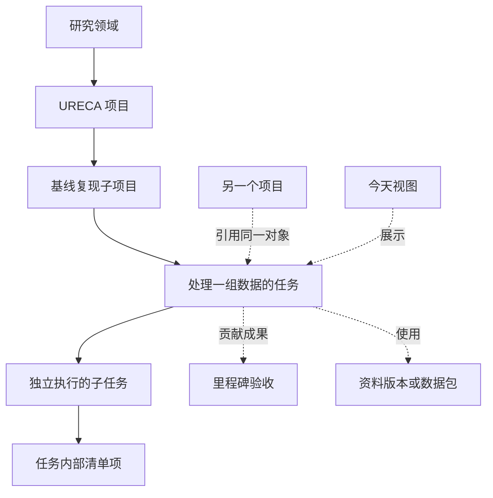

# 实施前审查与修订方案 · 2026-09-22 · v0.1

**结论：按用户最新明确的“只构建空软件、不迁移旧数据”范围，修订后的计划具备进入实施的条件。** 本轮已补齐功能、行为、父子语义、界面扩展、资源和恢复边界。实施时先验证最关键的技术连接，再完善功能和验收；性能、双端集成、扩展和灾难恢复仍须实测，不能把可以开工等同于已经达到交付标准。

## 本次建设范围（用户最新确定）

- 本次交付是功能可用、初始业务数据为空的软件。数据库结构、结构版本、必要系统配置和通用空白模板可以初始化；不预置 Y2S1 的真实课程、项目、任务、资料、反馈、个人规则、旧定时任务和业务历史。
- 历史覆盖表用于定义功能及行为，不作为导入任务清单。原系统字段差异、缺失旧记录、旧格式映射及唯一写入方切换均属于以后单独开展的数据迁移，不阻塞本次空软件建设。
- 测试使用独立合成场景和附件，业务测试库、演示环境与交付正式数据目录隔离。发布包不携带 `.analysis` 中的原系统提取数据、证据副本或测试记录；首次正常启动应能创建真正的空数据空间。
- “空”指初始数据，不指功能空壳。双端和单端操作、后台推理、层级、扩展、成果作业及适用外部适配器仍需按功能范围验收。没有 AI/外部服务配置时，界面明确引导配置并保留可用的本地能力，不把模拟响应冒充真实连接。
- 旧数据迁移延期，软件自身的备份恢复、数据目录搬迁、版本升级和模块结构兼容仍属于软件能力，用合成数据验证。账号凭据不进入交付包，旧通知任务不自动启用；真实接入测试使用明确配置的运行环境。

建议实施顺序：先打通空库启动、独立业务服务、Qt 界面和真实 Codex 接入；再按场景补齐业务与四级扩展；最后完成合成数据压力/故障/恢复验收、打包及全新空目录安装验收。此顺序是实施安排，不是本轮已执行的工作。

本轮没有实现应用、迁移正式数据、清理原资料、修改 Y2S1 或启用/更改自动任务。下文区分本轮读取事实、审查前缺口、修订后的设计要求和待执行验证。

## 1. 本轮覆盖到哪里

| 对象 | 本轮覆盖 | 边界 |
|---|---|---|
| 当前软件化计划 | 阅读报告、方向草案、技术实现、核心业务执行设计及入口 | 审核设计与相互一致性，没有应用代码可验收 |
| Y2S1 文件 | 5,365 个普通文件的元数据；跳过 72 处目录连接/重解析点 | 不穿透到外部共享依赖；大小是逻辑大小，不是 NTFS 分配空间 |
| 非临时 Markdown | 322 份完整解码、元数据、标题和哈希读取 | 历史子审查 319 份，另外 3 份为主审查覆盖的 claims 治理 README |
| 历史业务链 | 166 个 WORK 的目标/用途/可提取结果，85 条 CAP、175 条 CHG、27 项 ADR | 业务字段和决定逐项语义核对，不重新执行日志中描述的工作 |
| 业务文档 | 全部 123 份非系统业务/导航/模板文档用途和结构；重点核读现行规则、领域契约及近期实例 | 标题覆盖不等于每个正文段落都重新逐字审阅；模板不算真实成果 |
| 日期计划 | 35 份日计划纳入结构与历史场景审查 | 不推断其中任务已经实际执行 |
| 总控工作簿 | 只读提取 12 表结构、8 张基础表原始值，补查任务/事件/复习用途及差异候选 | 未重算、未改写、未进行全表视觉或 Excel 应用验证 |
| 自动任务 | 只读核对 `y2s1` 晚间反馈、`y2s1-2` 晨间预警的现存配置 | 两者配置 ACTIVE 不证明每次触发或通知送达成功 |
| 当前机器容量 | 2026-09-22 18:15:43 的磁盘可用空间及全机物理内存 | 一次快照，不能证明旧系统耗时原因或新软件性能 |

系统初建的现存记载为 2026-07-28，见 [CHG-0001](D:/Y2S1/90_系统/变更记录.md:50)。CAP 与 CHG 各有一个编号空档，保留原编号，不补造记录。未留档的旧聊天、被覆盖/删除的原件、其他项目未链接的操作不能从当前目录证明完整恢复。

已归纳 **49 类历史场景**，166 个 WORK 全部有场景映射，未归类 0。审查前的设计表达为：已明确 13 类、部分明确 30 类、需补具体契约 6 类。这是设计覆盖分类，不是实现或测试通过率。详见 [历史场景覆盖矩阵](./历史场景覆盖矩阵_2026-09-22.md) 与 [逐 WORK 映射](./.analysis/2026-09-22-review/history/work_scenario_mapping.json)。

读取依据是本轮可发现的实际历史，不声称逐页复验了全部 PDF、逐帧看完视频或重新运行远端实验。初始路由未见活动写入者；18:38:45 终检与 18:15:43 盘点相比，全目录新增/消失/元数据变化均为 0，已读 Markdown 哈希和主工作簿哈希不变，见 [源版本终检](./.analysis/2026-09-22-review/source_stability.json)。这是未发现漂移的证据，正式迁移仍须取得专门的一致快照。

## 2. 审查发现与修订去向

下列项目均需要在实现中落实。此处“已补文档”只表示设计缺口已有明确处置，不表示功能已经完成。

| 编号 | 审查前缺口与具体后果 | 本轮修订 |
|---|---|---|
| R01 | 历史功能比任务管理更广：题目转 Notebook、简历变体、采集 Case、远端运行、环境诊断仅写成笼统扩展 | 建立学习支持、成果生产、资料包、研究采集、运行与外部操作契约；第 3 节逐类承接 |
| R02 | “只有明确要求才计划/重排”可能收紧已有习惯；低状态表达、软时间块、实质反馈局部调整未具体化 | 迁移带来源和有效期的使用策略，保留具体触发与停止条件；第 4 节 |
| R03 | 项目、子任务、清单、里程碑、资料的父子类型和汇总未定义 | 唯一主父、多引用、依赖另存；规定移动、继承、关闭、归档、恢复和去重；层级规范 |
| R04 | 模块可贡献“导航入口”，但无位置限制，功能增多会挤满首页 | 保持五个稳定入口；扩展挂对象页、动作、筛选、新建菜单和设置；复杂 UI 有单独验收 |
| R05 | 只写“缓存可重建”，未区分唯一成品与暂存；历史已有旧 PDF 覆盖事故 | 成果与资料版本不可变，同名不覆盖；按用途和引用回收，不能按 outputs/tmp 名称删除 |
| R06 | 没有总进程内存、解析峰值、后台并发、上下文和空间准入预算 | 分项预算、流式处理、分页、有限并发、日志/预览/备份增长控制；资源规范 |
| R07 | SQLite 选型未落实实际版本、长读/WAL 增长、临时卷满和提交结果不明 | 发布时核对实际库版本，短读短写、监测 checkpoint、满盘处置与回执恢复 |
| R08 | “有后台任务”未涵盖领取过期、旧进程迟到、取消竞争和事件循环 | 持久任务领取、执行世代及提交栅栏；取消/提交原子判定，重试与传播有界 |
| R09 | “备份成功”未覆盖附件一致性、恢复后旧客户端及外部通知重放 | 按备份实际快照固定附件版本；新世代恢复、隔离验证、外部副作用先对账 |
| R10 | 迁移可能把旧表或最新摘要全部当真；字段冲突、旧枚举和 ID 空档会被静默修平 | 保留原始值与来源、字段级映射、差异候选清单；不能让模型自行修正真实状态 |
| R11 | “高度扩展”没有区分配置修改与新代码；新增字段无法证明完整新功能可用 | 四级扩展契约，包含合法关系、双端操作、结果、失败、迁移、资源及兼容性 |

## 3. 49 类场景的承接方式

各场景的原始证据、用途与未实现边界在覆盖矩阵中；本节指定落入哪个模块，避免只记一个“以后扩展”的空位。

| 场景 ID | 承接模块 | 必须具备的接口/结果与界面位置 |
|---|---|---|
| H01—H06 | 信息捕获与资料目录 | 原话、来源断言及替代关系；不可变资料版本；资料包 manifest；缺口及教学周滚动；放收件箱、资料及对象资料页 |
| H07—H13 | 课程与学习支持 | 可配置课型；考核组件/尝试/聚合政策；知识点、题目、作答、错题、复测证据；聊天可直接解释，需保存时形成笔记或学习包 |
| H14—H21、H42—H43 | 规划与风险 | 精确/低状态/无精确排时/休整模式；多周路线、周期例外、准备窗口、软时间块与结束后处置；在今天、安排及项目阶段页使用 |
| H22—H29 | 项目、层级与研究 | 主线/旁线、候选/获准、里程碑、子任务、Case 和批次、量纲、实验定义与证据门；独立对象类型和领域页签 |
| H30—H31 | 运行与环境作业 | 本地/远端运行、环境、输入数据集、版本、参数、进度、日志和产物；保存连接/上传/执行/验收各阶段证据；管理客户端和聊天均能查状态/续接 |
| H32—H35 | 成果生产与验证 | 成果系列、用途/语种变体、不可变版本、生产作业、预览和质量检查、采纳/导出；文档、Notebook、图像、场景均由具体执行器承担 |
| H36—H38 | 外部来源、提交与活动 | 外部对象 ID、权限范围、版本、最近核对；“记录已提交”与“替用户提交”分开；外部回执和未知结果对账；活动结果分证据登记 |
| H39—H41、H44 | 提问、反馈与周期回顾 | 持久提问集、每个完成门、业务日期和来源版本；跨午夜/编号/指代回复；晨间预警与晚间询问不同策略；聊天和客户端都可读结果 |
| H45—H49 | 统一业务核心与维护 | 多对话续接、去重、受控恢复、历史、归档迁移、配置与版本诊断；保存视图、易读标题和稳定导航 |

### 成果生产是需要新增的完整业务链

建议增加 `create_artifact_job / get_job / cancel_job / inspect_artifact / adopt_artifact_version` 一组业务能力，名称为接口草案。作业记录输入版本、产物类型、允许工作目录、执行器、资源预算、状态和验证要求。

固定程序先登记作业、预计产物、归属工作目录和保留策略，再检查运行条件。获得授权的 Codex/工具可在独立工作目录生成文档、Notebook、辅助代码、图像或场景。产物从写出阶段就有受保护的候选记录；生成结束后固化哈希和内容版本，再做对应内容/格式/运行验证，通过后提升为可采纳状态。修改产物生成新版本，不覆盖已固化版本。失败、取消或中断留下的内容保持明确状态并可恢复，不能因未通过验证而成为无人管理的孤立文件。生产执行器不能直接操作正式数据库或改写其他作业的成果。

“日常不生成临时脚本写库”仍适用于事实管理。用户要求创建代码、Notebook 或复杂成果时，生成代码本身是产出/生产步骤，需要明确支持。质量检查只针对产物和受影响内容；普通反馈保存不因此触发文档渲染。

结果状态至少区分：已生成、内容/格式已检查、运行已验证、已采纳、已导出、外部已提交、外部已验收。简历旧版本的外部评分不能继承给新版；Notebook 已生成不等于已作答，程序跑通不等于知识掌握。

### 资料包与研究采集不能简化成一张附件表

Notebook、CSV、图像等组成具有包内相对路径的资料包。逻辑引用可复用内容哈希，但执行时按包 manifest 物化完整目录；去重不能删除必要的包内成员。移动、导入、恢复以可核对的完整包处理。

采集模块保留批次、Case、mapping、操作步骤、质量核验、上传和验收关系。对象数量、视频段数、有效分钟、实际工时是不同度量，不互相猜算；批次汇总不与逐 Case 实际重复相加。研究主线与实验室旁线共享资料时，不共享完成结论。

本地环境修复、远端运行和替用户执行外部动作通过具体适配器完成；未接入时应能记录、显示待配置并提供可靠接续，不能冒充已执行。完整迁移验收要求相应适配器或用户认可的替代路径实际可用，不能只实现一个空按钮。

## 4. 使用习惯的兼容规则

以下来源本轮已重新核对。它们属于用户业务配置和行为契约，不应写死为所有用户通用规则。

1. “今天做什么合适”和明确低状态表达可以触发相应计划；低状态不要求用户再次确认坚持生成。信息不足时按已有规则给可执行的无精确排时版本，而非填造日期/通勤。
2. 自主任务的计划钟点是启动和容量检查点；完成门决定必要内容。延迟开始重新锚定，不能为了准点或四小时复核点删掉必要学习内容。真实睡眠、健康和外部硬事件约束仍需保护。
3. 普通反馈先保存事实。已明确采用的局部调整策略可在重复安排、缺失前置、截止/依赖冲突、容量不可行或优先级实质变化时触发最小调整；原缓冲可吸收则不重排。策略保存来源、适用范围和版本，不能扩大为全未来自动均衡。
4. 短期恢复、出行、无精确时间和临时减负有生效/失效边界；不永久修改个人能力或作息。多周路线与日计划分开，错过预计阶段日不自动生成无限债务。
5. 23:00 的提问覆盖当日尚未明确反馈的独立完成门，同任务重复块去重；编号回答、“同”“其他都没做”必须绑定该轮持久问题集。跨午夜按所回应的业务日期归属。无回复只留询问记录，不生成实际执行事实。
6. 08:00 晨间风险检查与晚间反馈分开；当前配置要求每天输出，无风险也简短确认。全 active 范围先在服务端完整扫描，模型上下文 Top-N 不能代替防漏检查。不同通知规则保留各自“无变化时是否输出”的配置。
7. 正式取消、本人不去、改为异步学习、线上替代提交和已参加是不同状态。本次课取消不能自动取消所有准备；线上提交计考勤时建立替代完成门，未知截止保持待确认。
8. 标题保持易读，来源/制定目的/后台 ID 分开显示。内容问答可以仅在聊天返回，不强迫每次解释都生成新任务或新文件。

来源：[规划触发与时间块](D:/Y2S1/01_规划与日程/规划规则.md:61)、[局部重排条件](D:/Y2S1/01_规划与日程/规划规则.md:96)、[生活与阶段边界](D:/Y2S1/01_规划与日程/生活节奏与约束.md:10)、[晚间反馈配置](C:/Users/James/.codex/automations/y2s1/automation.toml)、[晨间预警配置](C:/Users/James/.codex/automations/y2s1-2/automation.toml)。配置读取不等于验证实际通知投递。

## 5. 层级和 UI 如何保持清晰

详细定义见 [数据层级与界面扩展规范](./数据层级与界面扩展规范_2026-09-22.md)。统一采用三种独立结构：导航回答“从哪里进入”，主归属回答“主要属于谁”，类型化关联回答“还与谁有关”。

上图为结构演示，不是创建了实际项目。每个对象有稳定 ID、最多一个主父；引用同一对象不复制状态。里程碑不是强制中间目录层，事件/反馈/资料关系不混进任务包含树。父完成不自动完成孩子，所有孩子完成也不自动证明父项目已交付。领域无须因为项目结束而“完成”。

一级入口保留“今天、安排、项目与领域、资料、复盘”；捕获、搜索、收藏、通知和设置在统一位置。模块新增内容挂对象页签、表单、动作、筛选、新建类型和设置。增加“实验运行”后，它出现在 URECA 的相关页签和新建菜单，首页不自动多一个一级导航。

项目树与面包屑显示主归属，跨项目关联单列。拖拽区分移动归属、添加引用和排序。移动需检查新旧父、祖先版本和继承影响；归档/删除检查活跃子项、共享资料和未来任务，不默认级联。跨项目的个人总工作量按对象 ID 和实际贡献范围去重。

扩展分四级：字段/视图配置、规则配置或模块、工作流、全新业务类型。前两类常见变化尽量不改核心代码；新算法、执行器或复杂 Qt 视图仍需开发和发布。每项扩展必须声明数据/关系、双端操作、可读结果、错误/取消、迁移兼容、索引和资源成本。工具说明按当前业务发现，不能把所有模块说明塞入每次对话。

## 6. 内存与存储压力的处理

### 本轮测量

Y2S1 逻辑文件总量约 **8.63 GiB**，其中 MP4 约 **6.89 GiB（79.79%）**；三个临时/输出根目录约 **1.33 GiB**，这不是可直接删除量。与 9 月 14 日文件清单相比新增 435、消失 1、大小/修改时间改变 20；未对全部媒体做哈希复核。

当时 D 盘剩余 **282.40 GiB**，全机物理内存可见 **31.43 GiB**、可用 **16.69 GiB**。这说明该时点没有容量耗尽的证据，不能据此解释或排除其他时段的性能问题。机器内存、软件进程内存、磁盘占用、模型上下文是四项独立指标。

### 修订后的运行要求

详细测量定义与故障场景见 [资源预算与恢复规范](./资源预算与恢复规范_2026-09-22.md)。候选指标如下，均为待验证目标：

| 项目 | 初始约束 |
|---|---|
| 服务+界面+轻量适配器 | 空闲私有提交内存合计目标 ≤350 MiB，普通交互峰值 ≤600 MiB；另报受管 AI/重型进程及总进程树开销 |
| 后台并发 | 应用管理的 AI 推理 1 个、重型解析 1 个，其余排队；不声称控制用户另外打开的 Codex 对话 |
| 大附件 | 复制/哈希按 4 MiB 块，PDF 按页，视频按需处理；解析子进程树默认 1 GiB 预算，复杂渲染另设经过验证的资源档位 |
| 界面/API | 默认每页 100 项、最多 500 项；树按分支展开；附件不随对象打开而全文解码 |
| 可重建缓存与暂存 | 缓存/预览默认总 1 GiB；暂存默认总 2 GiB，超出需流式/分批/只引用或调整受控预算 |
| 日志与备份 | 诊断日志按 100 MiB 或 14 天轮换；审计和去重记录另存；备份按版本复用不可变大附件 |
| 模型上下文 | 业务输入包目标不超过 12,000 token；不足时补查/分页，完整硬约束在服务端检查；不承诺限制外部整段聊天 |
| 低空间 | 各涉及卷均预留，任务申报最坏新增空间；后台处理先暂停，不能耗尽普通事实记录空间；写失败不误报保存成功 |

这些阈值可经实测调整，但不能通过忽略外部子进程、丢失必要上下文或删除唯一证据满足数字。新 UI 没有浏览器缓存也仍需版本检查、取消订阅和有限缓存。后台读取不得在模型生成或用户停留页面期间持有数据库事务。

### 存储分类与真实恢复

原始证据、用户保留成果、正式报告、必要审计/去重凭据，与可重建预览、索引和处理暂存分开登记。只有来源可访问、可重建且无活跃引用的派生项参与自动回收。历史 [CHG-0071](D:/Y2S1/90_系统/变更记录.md:130) 已记载旧 PDF 覆盖且无备份，说明版本不可变和同名不覆盖必须成为测试条件。

SQLite 实际加载版本须包含官方 WAL-reset 修复；本轮分析环境为 3.53.1，不代表新软件运行版本已经选定。还须监测长读/checkpoint 和处理满盘，不能删除 WAL 或在满盘时自动 VACUUM。[SQLite 官方 WAL 文档](https://www.sqlite.org/wal.html) · [VACUUM 空间要求](https://www.sqlite.org/lang_vacuum.html)

备份以实际数据库快照中的附件版本清单为准，在建立保留引用期间阻止物理回收，保证文件版本与该快照一致。新备份验证成功前保留最后一份可恢复副本。恢复后产生新数据集世代，旧客户端、候选、工作进程失效；外部提交和通知先核对回执，不能盲目重放旧队列。

## 7. 本次空软件的验收门

本轮补齐的是设计；下面各门均为 **未测试**，实施后需提供真实证据。

| 门 | 必须演示 |
|---|---|
| G0 空系统首次使用 | 无项目/任务/资料/个人规则时正常启动；空状态可操作；首次创建有明确路径；缺少 AI/外部配置可诊断；正式数据空间不含合成测试或旧资料 |
| G1 行为兼容 | 低状态直接给方案、软时长不删完成门、部分反馈、跨午夜指代、无回复、实质局部重排、08:00与23:00策略、线上替代课次 |
| G2 双端与多对话 | 客户端关闭只用 Codex；外部聊天关闭只用客户端和已配置 AI；新对话续接；旧版本冲突；迟到结果和取消竞争 |
| G3 层级与 UI | 主父/引用/依赖区别，父子完成门，移动继承，清单提升，归档与共享文件；十个模块启用后导航仍清晰 |
| G4 四级扩展 | 实际增加一个字段、一个规则、一个流程和一个新业务类型；双端创建/查询/修改/失败/恢复均可操作 |
| G5 历史功能 | 从 49 类覆盖表逐项用合成输入落实能力和验收；成果生产、可执行资料包、采集 Case、远端/本机作业不能只保留空接口；不导入真实旧记录 |
| G6 资源增长 | 合成的当前量级与 10,000任务/1,000事件/100,000历史记录；测试附件、宽树、多年周期；后台负载下响应；30分钟及8小时内存趋势，不能以空库代替压力测试 |
| G7 故障恢复 | 模拟库卷/临时卷/备份卷满、长读/WAL增长、中断附件登记、回执丢失、工作进程失效、索引重建空间不足；不占满用户真实磁盘 |
| G8 软件恢复与兼容 | 合成数据备份后在新目录独立恢复，原测试目录不可用时主流程仍可运行；版本升级、跨学期和缺模块/缺附件分类；旧系统数据迁移不在本次验收中 |

专项规范另附 27 项层级验收和 18 项资源/恢复场景；与核心说明中的业务场景共同组成测试集，应按能力/规则 ID 去重关联，不机械重复测试数量。

基础原型先验证主业务链、层级和双端接续，同时跑四级扩展样例及小规模资源测量。本次以软件功能、真实集成和合成数据验收完成为交付条件，交付初始业务库为空；不会切换原系统事实源。未来若单独启动旧数据迁移，再核对实时数据、解决差异并逐类切换唯一写入方。

## 8. 后续遗忘或临时新增功能怎样进入系统

使用统一的功能需求记录：具体使用场景、现有对象、所需动作、预期结果、应出现的位置、是否改变父子/规则、资源及外部依赖。先判断能否通过视图/字段/规则/工作流表达，再决定是否增加类型和专用界面。

新增能力复用统一捕获、身份、关系、事务、历史、调度和结果框架；它仍需声明边界并通过对应验收。这样能减少牵一发而动全身的改动，但不能保证任何未知功能都不需要写代码。用户无需提前枚举全部未来需求，系统也不能把任意自由文本需求直接变成未验证的动态脚本。

所有新模块由能力注册表登记且挂载到指定 UI 区域。停用或升级不能抹掉已有数据；新字段影响老视图、旧聊天工具、索引和备份时都有版本处理。原生 Qt 前端约束保持，日常数据操作不依赖 npm 构建；新代码发布可正常重启受影响组件。

## 9. 可复核产物

- [历史场景覆盖矩阵](./历史场景覆盖矩阵_2026-09-22.md)：49 类场景、来源和审查前缺口。
- [数据层级与界面扩展规范](./数据层级与界面扩展规范_2026-09-22.md)：关系、父子生命周期、四级扩展、UI 挂载和验收。
- [资源预算与恢复规范](./资源预算与恢复规范_2026-09-22.md)：预算定义、数据保留、进程与数据库边界、故障测试。
- [本轮盘点摘要](./.analysis/2026-09-22-review/inventory_summary.json)、[机器容量](./.analysis/2026-09-22-review/machine_snapshot.json)、[覆盖核验](./.analysis/2026-09-22-review/history/coverage_summary.json)：只读审查证据，不是正式业务数据。
- [文档与映射检查](./.analysis/2026-09-22-review/review_verification.json)：9 份设计/报告的本地链接、源码行号范围、文本编码、代码块及 49 类场景/166 个 WORK 映射检查；没有因此声称应用或压力测试通过。

本轮详细修订细化原方向草案和技术说明；同一条目有出入时，以本报告链接的本轮具体约束为准。用户已确认的目标与使用偏好仍高于实现建议。原系统字段差异仅列为迁移待核对项，本轮未擅自修复。
