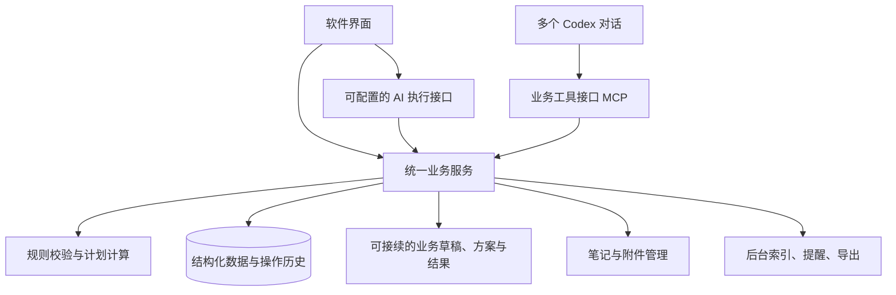

**个人管理系统：技术实现与使用逻辑 · 2026-09-16 · v0.2**

用户最新明确：本次只构建空软件，不迁移 Y2S1 数据。本文涉及正式旧数据导入、对照和切换的步骤仅保留为未来工作，本次验收使用隔离的合成数据；软件自身备份恢复和结构升级能力仍保留。具体范围以 [实施前审查报告](./实施前审查报告_2026-09-22.md) 为准。

实施前复核后的详细约束由 [2026-09-22 审查报告](./实施前审查报告_2026-09-22.md) 统一索引，包含父子模型、UI 挂载、资源预算、成果作业及历史行为兼容。本文件保留总体架构；细节冲突以本轮专项规范为准，尚未实施。

2026-09-22 执行协议补充见 [核心业务层执行设计](./核心业务层执行设计_2026-09-22.md)。它明确两种推理入口、后台候选返回结构、日常不生成临时脚本以及各类业务的逐步处理。下方计划校验接口已据此消除“工具内隐式调用另一轮 Codex”的歧义。

本说明将现有设计落实为存储、业务操作、Codex 接口和验收条件。已确认的用户需求是：界面与 Codex 均能完成主要操作；工作簿原本用于直接查看，但用户实际上没有使用这一入口；保留现有功能与使用逻辑，重点解决完整调整流程过慢的问题。

本轮新增的确定要求：业务逻辑必须保留扩展接口；界面不采用 TypeScript 前端及 npm 构建流程；保留以 Codex 聊天录入、更新、获取和查看输出的习惯；支持多个对话、新对话、双端交替与并发，以及配置正常时任一端独立使用。新增的运行与验收细节见第 11—15 节。

以下为实现建议，尚未部署应用、连接 Codex 或迁移正式数据。本次只在软件化工作目录维护设计材料。原 Y2S1 的写入和校验要求仍适用于留在原系统中的数据。

**1. 将优化目标定为一次完整业务操作。**

现有脚本已经能直接解析工作簿的 OOXML，不是所有读取都依赖截图。原系统性能基线也记录：机器检查和渲染所需时间远低于完整事务，主要成本包含多轮上下文读取、临时处理工作簿、同步多个事实源/投影以及反复定位保护区。因此，更换数据库只是其中一步，还要缩短 Codex 的操作链。

建议将普通流程收敛为：

> 获取与本次操作有关的事实 → 提交明确的业务操作 → 程序完成校验与保存 → 返回结果和变化。

这里有三项可验收的改变：事实以结构化数据保存；普通操作不渲染工作簿、不重写多份 Markdown；规则校验、关联更新、操作日志由程序固定执行。具体提速幅度必须通过同场景对比确定，不能从数据库查询耗时推算聊天总耗时。

证据：[直接读取工作簿的实现](D:/Y2S1/.agents/skills/y2s1-daily-plan/scripts/Y2S1.DailyPlan.psm1:170)、[原系统历史性能分析](D:/Y2S1/90_系统/性能基线.md:123)、[工作簿写入要求](D:/Y2S1/.agents/skills/y2s1-context-router/references/execution.md:31)。性能分析是历史记录，本轮未重新测量完整写入事务。

**2. 建议的实现形态：一个本地业务服务，两种入口。**

建议先以 Windows 本机单用户场景验证，结构上保持程序与用户数据分离。界面和 MCP 是同一业务服务的两个适配入口；业务服务独立于两端进程存活，启动、重连和身份核对见第 13 节。模型提出的操作也经过同一业务服务。界面与聊天的显示状态可以不同，已保存的业务事实只有一份。

| 部分 | 建议实现 | 解决的问题 |
|---|---|---|
| 业务数据 | SQLite，按任务、事件、反馈等建立有约束的数据表 | 精确查询与更新；一次保存关联事实和日志 |
| 业务服务 | 候选采用 Python，按明确模块契约组织，提供有版本的结构化接口 | 界面、Codex 具有同一套行为；后续可扩展领域和操作 |
| 界面 | 候选采用 PySide6 + Qt Widgets 原生桌面界面，直接调用业务服务 | 开发调试不依赖 npm 前端编译；日常操作运行已安装程序 |
| Codex 接入 | 软件向 Codex 提供 MCP 业务工具 | Codex 操作任务和反馈，无需定位单元格或临时编写修改脚本 |
| 资料 | 数据库登记索引、版本、来源和关联；文件保留在独立资料目录或外部位置 | 大文件不进入每次查询或模型上下文；换目录可重连 |
| Excel、Markdown 导出 | 按需生成，或在后台刷新带版本的导出 | 延续可读性和可携带性，不成为每次保存的前置步骤 |

SQLite 适合本地应用数据，且支持同一数据库内的事务保存；它是当前单用户方案的合适候选。多人远程同时使用、跨设备实时同步需要另行设计，不能把正在使用的数据库文件直接放入网络共享目录来替代同步。[适用场景](https://www.sqlite.org/whentouse.html) · [事务保证](https://www.sqlite.org/transactional.html) · [WAL 的同机限制](https://www.sqlite.org/wal.html)

Codex 官方支持本地 STDIO 与 Streamable HTTP MCP 接入。优先让现有 Codex 调用软件提供的工具即可；内嵌完整聊天体验可后续评估 App Server。协议可用不代表本机集成已经验证，首个原型应包含一次真实连接测试。[MCP 官方文档](https://learn.chatgpt.com/docs/extend/mcp?surface=cli) · [App Server 官方文档](https://learn.chatgpt.com/docs/app-server)

技术栈和界面容器仍是候选；先固定下述业务边界，使其不依赖具体前端框架。

PySide6 官方示例支持直接运行 Python 编写的 Qt Widgets 界面，也提供桌面应用部署工具。日常运行与发布打包是两回事：发布新版本仍需打包和验证，不能承诺整个项目永远无需构建。复杂日历、中文输入、长列表、缩放与报告展示应在原型中检查。[Qt Widgets 入门](https://doc.qt.io/qtforpython-6/gettingstarted.html) · [桌面部署](https://doc.qt.io/qtforpython-6/deployment/deployment-pyside6-deploy.html)

界面刷新和数据缓存仍需单独设计。业务代码变更后明确重启相关进程，运行版本和加载的数据空间可核对；不依赖开发热更新来证明新代码已经生效。数据变更采用第 12 节的版本与变更通知机制。

**3. 数据模型保留原有含义，明确事实的唯一位置。**

不按 Excel 的 12 张表逐格复制数据库。先判断哪些是事实、哪些是计算结果、哪些只是展示。课程主页中的正式课程信息、工作簿中的任务/事件/反馈、Markdown 中的个人规则，都按字段的权威来源分别迁入；不能默认某一种文件拥有全部事实。

| 数据组 | 需要保存的内容 | 必须保留的区别 |
|---|---|---|
| 个人、领域、课程、项目 | 身份、目标、阶段、领域字段、生效范围 | 长期设置与本周临时例外 |
| 任务与依赖 | 稳定 ID、完成标准、子项、状态、估时、截止、下一步 | 部分完成、整体完成、提交、掌握分别表达 |
| 事件与周期安排 | 日期、时段、时区、周期、生效区间、单次例外 | 事件与待办分开；取消一次不删除整个周期 |
| 计划与时间块 | 计划版本、范围、依据、安排、承接任务 | 计划、实际执行、事后评价分开 |
| 反馈与学习记录 | 用户原话、发生时间、报告时间、明确完成范围、阻塞、证据 | 未报用时与 0 分钟不同；学习记录不等于掌握度 |
| 收件箱、来源与资料 | 原始信息、来源定位、确认情况、版本、关联对象 | 未发布、未获得、未阅读、访问受阻分开 |
| 规则、历史与后台工作 | 规则版本、操作前后值、操作者、请求去重、后台处理进度 | 数据已保存与资料索引/导出完成分开 |

每个业务对象具有稳定 ID 和版本，迁移时保存旧 ID 映射。状态、来源、确认程度是不同字段；允许保留未知及其原因。未提供的字段不被模型自动补齐。

日期必须区分“只有日期”“当地日期和时间”“确切时间点”；周期日程同时保存时区和例外。Excel 小数时间在导入边界统一转换并保留原值备查，不能让 `0.559027…` 进入日常业务接口。相对日期记录解释依据；“明天下午两小时”没有明确起止时刻时，保存为窗口约束。

资料正文、长说明仍可保留，不强制全部拆成字段。内部资料以稳定 ID 和相对路径关联；外部资料用可重新映射的根目录定位。索引、摘要和缓存可以重建，不能成为唯一证据。

**4. Codex 调用业务动作，操作粒度以用户意图为单位。**

以下名称为接口草案。界面调用相同的业务实现，不必暴露这些技术名称。

| 业务操作 | 核心输入 | 返回内容 |
|---|---|---|
| `get_context` | 数据空间、用途、日期/对象范围、可选业务工作项与上次版本 | 相关事实、来源、规则、能力、接续状态、版本和覆盖范围；首次查询兼做业务上下文建立 |
| `capture_info` | 原始信息、来源、明确字段 | 已记录对象、仍待确认字段、关联候选 |
| `update_task` | 任务 ID、明确修改项、预期版本、请求 ID | 实际变化、新版本、关联影响与操作编号 |
| `record_feedback` | 对象、完成范围、证据/原话、可选实际用时、预期版本、请求 ID | 保存的反馈、允许更新的状态、仍未知内容 |
| `validate_plan_candidate`（原 `preview_replan`） | 调整范围、用户约束、结构化候选安排、依据版本 | 计划差异、确定性约束检查、不可行原因；本工具不启动模型 |
| `apply_changeset` | 变更集 ID、请求 ID | 全部提交的变化，或未提交及原因 |
| `find_materials` | 对象/关键词、筛选条件、分页 | 匹配资料、来源位置、索引状态、后续页 |
| `get_operation` / `undo_operation` | 操作编号；撤销时附当前版本 | 真实提交结果，或新的恢复操作与冲突说明 |
| `save_work_item` / `list_work_items` | 草稿、方案、待处理问题及范围，或检索条件 | 可跨对话继续的业务工作项、版本和状态 |
| `get_result` / `get_changes` | 结果编号或对象；变更游标 | 可在聊天中阅读的内容及依据版本；发生的业务变化和后续游标 |

上下文按业务范围查询，不把整个数据库或全部历史交给模型。候选任务可以分批，但必须返回总数、筛选条件和是否完整；指定计划区间的硬事件必须完整载入检查。数据不完整时，不得声称计划已经通过全部约束。

业务接口还需要表达用户授权的动作范围。明确要求记录反馈，可以直接记录；只有本次请求或既有有效局部调整策略覆盖实质影响时才重排，缓冲可吸收的偏差只记录。策略保存来源、适用对象/日期和版本。明确授权调整计划时，可以在既定范围内预览、校验和应用，无须固定再问一次确认。无法确定对象或会超出授权范围时，返回具体缺项。

模型负责理解自然语言、识别有意义的关联、提出取舍和解释；程序负责字段类型、时间计算、依赖、冲突、保存和审计。复杂排程可由模型提出候选，由程序检查；第一版无需解决所有自动排程优化问题。任何实现都不能把“模型认为检查过了”当作校验结果。

当前 Codex 对话与后台 Codex 不重复承担同一请求的推理：前者直接使用业务工具，后者由客户端/调度器的独立工作流入口调用并返回候选。后台候选由固定协调器校验和提交；各业务工具内部没有隐含的模型调用。确定性校验并不证明模型对原话的语义理解正确。

**5. 一次提交内部完成什么。**

一次 `record_feedback` 应在一个短数据库事务中完成：检查请求是否已处理 → 检查对象版本和合法输入 → 写反馈 → 按明确证据更新相关任务 → 写变更日志和操作回执 → 登记需要的后台工作 → 提交。

- 请求 ID 与请求内容共同去重。保存成功但响应丢失时，同一个请求重试返回原结果；同 ID 携带不同内容应报冲突。
- 界面与 Codex 同时修改时检查预期版本。遇到版本冲突返回差异，不用旧数据覆盖新事实。
- 计划应用还检查规则和日程范围的版本；预览以后新增了硬事件，即使原有对象没变，也必须重新检查。
- 用户意图要求一起生效的变化全部提交或全部失败。相互独立的大批导入可以逐项处理，但需明确报告每项结果，不把部分成功描述为全部成功。
- 模型推理、截图、PDF 解析和文件复制都不放在数据库写事务内。事务只覆盖同一数据库中的变化；附件等文件操作另有暂存、状态、重试和对账机制。
- 普通操作提交后返回真实结果。资料索引、导出等可在后台完成，并显示独立状态。后台工作从同一事务登记的持久任务领取，避免保存成功后漏掉后续处理。
- 撤销是检查当前版本后产生一次恢复操作，保留历史；不能在恢复旧值时覆盖后来发生的修改。外部已发送通知不能靠数据库撤销收回。

今天、任务列表、日历从同一份数据查询，必要缓存跟随版本失效。因而一次反馈不需要再让 Codex 手动更新三份展示文档。长时间资料处理保留可恢复的执行记录；普通数据修改无需手写一套 WORK/claim/CHG 文件，但仍要保留它们原来承担的追踪、并发和恢复能力。

**6. 用三类规则约束行为。**

| 规则类别 | 例子 | 由什么保障 |
|---|---|---|
| 必须成立的数据与行为规则 | 无回复不生成执行事实；反馈不自动扩大为全局重排，仅按有效策略最小调整；重复提交不重复记账 | 业务代码、数据库约束、场景测试 |
| 用户可配置的生活与计划约束 | 作息、缓冲、准备提前量、低状态容量、某周例外 | 有版本和适用范围的设置；界面可查看修改 |
| 需要判断的建议 | 今天优先哪项、如何分解困难任务、复盘原因 | Codex 提议并解释，受前两类约束 |

数据事实和计划有效性必须分开。用户报告晚睡、迟交、时间重叠等真实发生情况时，系统照实保存并提示影响；不能因为不符合计划规则就拒绝事实。生成新计划时，再按明确约束检查，安排不下则列出冲突和未安排项，不能悄悄挤占睡眠或捏造可用时间。

来源之间存在冲突时保留两项证据，明确哪个字段待确认。任务完成不会自动证明附件已生成、材料已提交或能力已掌握。历史执行不因今天的重排而被改写。

**7. 用一个操作走通两种入口。**

以下是合成示例，不是实际学习反馈：“习题前 3 题完成，第 4 题卡住。请把剩余部分放到明天，原来的课和休息保留。”

1. 界面选择对象并填写字段；Codex 通过上下文找到同一对象和完成标准。身份有歧义时只澄清身份，不先猜测写入。
2. 保存前 3 题的完成范围和第 4 题的阻塞。没有明确报告的用时、掌握度和其他题目状态保留未知。
3. 因为示例明确要求重排，再计算明天的硬事件、依赖、休息和容量，形成计划差异。没有足够空档或估时依据时，返回待补信息/未安排项。
4. 应用有效且在授权范围内的计划变更。提交前如日程已变化，重新检查；反馈已成功保存而计划不可行时，分别说明两项结果。
5. 界面和 Codex 立即读取相同业务版本，操作历史说明反馈与重排的关联。重复发送同一请求不会重复计入完成量。

这个流程将“事实保存”和“计划调整”分为两个有回执的动作：新计划不可行不应抹掉已经确认的事实。只有完成反馈且不存在有效局部调整策略所覆盖的实质影响时，流程在记录结果后结束；不会借反馈全面重排。

**8. 用行为验收确保迁移后仍按原逻辑工作。**

以现有 [全量能力清单](./软件化方向草案_2026-09-16.md) 为覆盖表；每项能力关联原规则来源、业务接口、界面入口和验收场景。以下场景先成为首个原型的共同检查标准：

| 场景 | 必须观察到的结果 |
|---|---|
| 部分完成、未报用时 | 只更新明确范围；整体完成和用时没有被推断 |
| 完成但未提交；下载但未阅读 | 分别保留状态，不传播成其他阶段已完成 |
| 没有反馈 | 不生成完成/失败/用时事实 |
| 普通反馈没有实质影响，或用户明确只记录 | 不改后续计划或永久偏好；有实质影响时须匹配有效局部调整策略 |
| 单次停课、跨日事件、仅日期截止 | 时间语义正确，其他周期实例和未知钟点保持原义 |
| 临时减负、固定课、休息与缓冲 | 设置按生效范围应用，计划容量不足可明确失败 |
| 报告不符合计划的真实执行 | 事实可以保存，偏差独立提示 |
| 过期预览遇到新增事件 | 检出变更并重算，无静默覆盖 |
| 保存中断、响应丢失与重复重试 | 同一意图只生效一次；可查清是否提交 |
| 界面与 Codex 同时修改 | 冲突可见，不丢掉任一方的新事实 |
| 来源冲突、候选任务分页 | 冲突与不完整范围可见，无虚假确定性 |
| 反馈成功、重排失败 | 真实反馈保留，计划未成功单独报告 |
| 撤销前又有新修改 | 检查版本，不能用旧状态覆盖新操作 |
| 双入口执行同一操作 | 业务结果、约束与历史语义一致；操作者和时间可不同 |
| 备份换目录恢复 | 对象关系、规则、证据引用和附件重新定位均可用 |

自动化验收应检查外部可观察结果，包括失败和中断场景。程序检查通过后，还要实际从界面操作、通过 Codex 调用，再读取结果；单测不能代替双入口验收。

每次数据写入执行影响范围内的确定性校验；全量数据核验放在导入、结构迁移及专门审计中。界面改动进行界面检查，生成导出文件时检查其内容和版式。旧工作簿仍作为主源期间，继续遵守其专用写入要求。

**9. 速度采用可测量目标，暂不承诺完整聊天耗时。**

建议在相同机器、明确数据规模和无锁竞争条件下，将以下作为首个原型的候选验收指标，实施后报告实际值和失败情况：

| 路径 | 初始目标 | 计时边界 |
|---|---|---|
| 本机常规查询/小批反馈保存 | 第 95 百分位不超过 300 ms | 服务收到请求至产生已提交回执，包含数据库持久化 |
| 打开今天、更新任务后的界面 | 第 95 百分位不超过 1 秒 | 界面动作至可用内容呈现 |
| 获取一次业务上下文 | 第 95 百分位不超过 1 秒 | 服务查询、关联和生成结构化结果 |
| 普通 Codex 记录反馈 | 上下文足够时一次写入调用；需查询时通常一次查询加一次写入 | 另报模型时间、协议启动和工具往返；不含歧义澄清 |
| 资料提取、备份与导出 | 不阻塞普通操作，进度和失败可查 | 独立统计后台时长和前台影响 |

这些是建议门槛，不是测量结果。可用脱敏/合成的 10,000 项任务和 1,000 项事件作为扩展规模，并单独测试当前规模；固定说明数量、关联、日期跨度和附件情况。至少记录 100 次重复操作的中位数与第 95 百分位，冷启动单列，失败与重试不从结果中隐藏。

端到端对照使用同样的普通反馈、部分完成、局部重排和复杂重排场景，分别报告程序处理、模型等待/推理、工具往返、用户补充信息和总历时。已有快照和可读导出用于隔离比较，不为测速制造原系统的真实变更。不要通过减少来源信息、漏掉硬事件或降低持久化保证获得表面提速。

**10. 实施顺序围绕一条完整业务链。**

1. 固定最小数据关系与上述场景，建立规则到接口、界面和验收用例的对应表。对现有公式和流程提取业务含义，已发现的旧缺陷列为待修正项，不照搬为新行为。
2. 在独立目录用合成数据实现“查询任务 → 记录部分完成 → 查看今天与历史 → 必要时调整计划”。接通原生界面和 MCP，实际验证新对话接续、任一端单独使用、并发、中断、重复请求和耗时，再决定正式数据切换。
3. 对正式数据做只读导入对照：来源、数量、ID、字段、日期时间、关系、未知值和计算结果分别核对。9 月 14 日阅读快照不能直接用作当前迁移底稿；正式导入前协调活动写入，取得一致来源快照。
4. 以数据类别逐块切换唯一权威写入方，显式记录切换边界。未迁移类别继续使用旧流程；已迁移类别的旧文件作为只读参考或导出。跨边界关系通过稳定 ID 和版本追踪，不允许同一事实两边自由修改。
5. 第一条链验收通过后扩展其余完整功能；复杂排程、复习、资料、提醒、复盘和跨学期能力均在覆盖表中逐项交付。

迁移必须可退回。保留不可变的原始导入副本、字段映射和差异报告；切换后的撤回要先处置新增变化，不能直接打开旧工作簿继续写。完整恢复包包含数据库一致快照、规则、数据结构版本、资料清单和声明包含的附件；外部资料明确列出重连要求。

运行中备份使用数据库支持的一致快照机制，或在正确关闭数据库后复制；不把随手复制一个活动 `.db` 文件当作完整备份。数据库快照中的附件版本应保持不可变，并核验清单及文件完整性，再在新目录实际恢复验证。[SQLite 在线备份说明](https://www.sqlite.org/backup.html)

**11. 跨对话接续的是业务状态和结果。**

用户可以继续把 Codex 聊天作为日常录入和查看窗口。为保证换对话后可用，服务中需保存四类信息：已确认事实；有范围和生效时间的个人规则；尚未完成的业务草稿/方案；已生成结果及操作回执。每项都能按稳定 ID、日期和关联对象检索。

| 信息 | 保存方式 | 新对话如何使用 |
|---|---|---|
| 用户明确报告的事实与长期偏好 | 结构化字段、原话/来源、版本、适用范围 | 查询与本次请求有关的有效事实和规则 |
| 已形成但未应用的方案 | 业务工作项，保存目标、约束、备选、未决问题和依据版本 | 可继续比较或修改；草稿不能被当作已生效安排 |
| 已授权且中断的操作 | 业务范围、请求编号、已提交步骤和剩余步骤 | 先查真实状态，复用请求去重；不凭聊天中的“开始执行”判断已完成 |
| 计划、复盘、报告等输出 | 结构化结果与可读快照，附生成时间、来源和版本 | 直接在新聊天中查看原结果，或明确请求按现状重新生成 |
| 普通闲聊和未保存的讨论 | 留在聊天本身 | 不承诺新对话自动获得这些内容；要接续时保存为有状态的业务草稿 |

结果接口应返回适合聊天直接展示的文字、表格、摘要和必要附件引用，不能只给出“打开客户端查看”。长结果可以分页、展开或导出。新对话要求“查看昨天生成的计划”时读取原结果；要求“现在还有什么没做”时查询最新事实。历史快照与当前查询明确区分。

在配置的 Codex 使用范围内提供可发现的业务工具，并通过简短的服务说明/入口指令引导每次业务请求查询上下文。`get_context` 一次返回所需事实及版本，避免先读多份说明再查询数据。旧对话继续工作时同样刷新；不能把对话还在视为数据仍新鲜。

Codex 官方支持用户级或可信项目级 MCP 配置，也读取服务的 `instructions`。因此，跨项目使用应评估用户级配置；只写在一个项目下的入口说明不能保证其他目录中的新对话加载它。说明用于引导行为，接口本身仍检查数据空间、当前规则和版本。[MCP 配置与服务说明](https://learn.chatgpt.com/docs/extend/mcp?surface=cli) · [项目指令发现范围](https://learn.chatgpt.com/docs/agent-configuration/agents-md)

每次上下文包含 `workspace_id`、数据集世代、相关对象版本、规则/能力版本、读取时间与覆盖范围。写入带回相应上下文凭据；服务在执行时重新检查依赖，并返回 `CONFLICT`、`CONTEXT_REQUIRED`、`NEEDS_INPUT` 等明确结果。数据库恢复后更新数据集世代，旧预览与旧游标必须失效。初始化上下文不是授权写入。

业务工作项 ID 与 Codex 对话 ID 分开。同一业务可在多个对话继续，一个对话也可处理多个业务；对话 ID 仅在可靠取得时作为来源信息。不能用 MCP 连接 ID 推断聊天身份，也不能将一条传输连接等同于一项业务。多个“昨晚方案”候选时，返回短列表让用户定位。

需要保留跨对话的授权时，记录具体业务对象、动作范围和方案版本；后续接续仍核对范围与新变化。保存一项草稿不会自动授权应用它，先前明确的有效授权也不因更换聊天就机械重复询问。宿主工具权限另行遵守。

**12. 两端更新同一份数据，显示通过版本和通知跟进。**

每个已提交业务变化产生操作回执和持久变更记录，包含受影响对象、版本、来源及序号。通知在提交后发出。两端通过这些记录重新读取受影响视图，不交换各自的整份本地状态覆盖数据库。

- 客户端订阅变更流，收到相关变化后重新读取列表、日历或详情。断线重连带上游标补读；游标太旧或序列有缺口时重新获取快照。事件通知可重发，客户端按编号去重。
- 通知连接失败时采用轻量版本检查作为补救，窗口重新激活时也校对版本。最后显示的内容有读取时间；断开连接时显示“尚未更新”，不得把本地旧内容显示为刚保存成功。
- 每次成功保存的回执包含新版本。发起操作的一端至少读取到该版本再宣告显示已更新；缓存按数据空间、数据集世代、对象/查询和相关版本管理。迟到响应不能覆盖更新的结果。
- 用户正在编辑的表单保留本地未提交内容。其他端有修改时提示冲突并提供差异，不用自动刷新抹掉正在输入的文字。
- Codex 在每个业务请求中重新查询或补读相关变化。没有工具查询的普通聊天回答，不能由后台保证是实时事实；接入规范要求业务回答标明所依据的查询结果。
- 业务提交由服务执行版本和范围检查。两个对话同时提交同一旧版本，只能按明确合并规则处理；涉及同一状态、日程或相互影响约束时返回冲突，并重新计算。

例如：对话 A 取得任务版本 7；客户端把任务改为版本 8；A 按版本 7 提交重排时，服务返回差异；A 读取新状态后再形成方案。对话 B 随后查询时直接得到版本 8，不需要先读取 A 的聊天记录。

MCP 规范包含可选资源变更通知，但它不能证明特定 Codex 宿主会把变化注入所有已有聊天、主动唤醒对话或修改旧消息。基线正确性依靠查询和服务端校验；资源通知只作为经实际验证后可启用的优化。[MCP 资源通知规范](https://modelcontextprotocol.io/specification/2025-11-25/server/resources)

请求 ID 能防止同一请求重试，不能自动识别不同对话生成的两个新请求是否表达同一次现实事件。任务进度优先按具体完成项登记，避免“再加三题”式累加；独立执行记录保留事件标识和来源，疑似重复时展示已有记录，不将文本相似当作绝对去重依据。

**13. 独立使用依赖后台服务，不依赖另一个窗口。**

建议部署为桌面客户端、独立业务服务、MCP 适配器三个运行角色，AI 执行器和后台工作器作为可配置组件。Python 业务服务不导入 Qt；关闭界面不会卸载业务规则和数据库。MCP 的轻量 STDIO 代理可随 Codex 启停，但代理关闭不应结束业务服务。

运行管理器根据持久配置启动/连接唯一服务实例；身份绑定依据数据空间 ID 和数据目录，不依据当前聊天的工作目录。多端同时启动时采用每个数据空间的互斥启动机制。服务应独立于客户端和代理的进程树，由登录启动或受控的首次使用启动机制管理；生命周期需在 Windows 上实际验证。

连接时核对服务版本、接口版本、数据空间、数据集世代和扩展能力。数据目录缺失、端口被其他服务占用或版本不兼容时明确报出原因，不能悄悄创建一个空库后显示“没有任务”。升级时先协调正在执行的操作，再更换运行版本并让两端重连。

| 使用方式 | 应正常工作的内容 | 配置前提 |
|---|---|---|
| 只使用 Codex，客户端关闭 | 主要业务查询、录入、反馈、计划、结果查看、历史与导出 | Codex 可发现业务工具，服务可启动并指向正确数据空间 |
| 只使用客户端，Codex 窗口关闭 | 主要管理操作、手动计划和规则校验、结果查看、历史与导出 | 本地服务与客户端版本匹配；普通操作不调用模型 |
| 只使用客户端，要求 AI 分析/生成计划 | 在客户端发起和接收结果，模型调用同一业务接口 | 配置可用 AI 执行器及其认证；不要求打开外部聊天窗口 |
| 两端同时使用 | 并发查询、提交、冲突提示、变化可见、统一历史 | 同一数据空间和兼容接口；双端刷新与重连验证通过 |
| 两个窗口都关闭 | 已提交的后台工作可继续；提醒按运行条件触发 | 独立服务仍运行且计算机可执行；关机/休眠期间按恢复策略补查 |

“仅使用客户端”必须逐项验证主要业务入口和必要设置，不能把冲突处理、恢复、来源查看等只能通过 Codex 执行的功能遗漏。“仅使用 Codex”同样不能在关键步骤要求打开客户端点一个唯一可用的按钮。

AI 执行器提供统一的“分析/建议/生成结果”接口。候选路线是通过 App Server 接入 Codex 运行时，或接入有明确认证的模型 API；二者都必须保留同一业务校验，不直接修改数据库。App Server 使用 JSON 消息，协议不要求界面采用 TypeScript。官方当前将 app-server 命令及 WebSocket 路径标为实验性，不能把长期稳定性视为已验证；应隔离适配层，记录兼容版本，并在原型阶段测试启动、认证、流式结果、中断和恢复。[App Server 官方说明](https://learn.chatgpt.com/docs/app-server)

2026-09-16 本机只读核对到 Codex CLI `0.154.0-alpha.6.2`，帮助中存在 `app-server` 和 STDIO 入口；2026-09-22 的版本核对见新增核心业务说明。两次都没有启动模型会话、测试登录或完成业务连接。客户端独立 AI 能力仍是必须验证的设计项，不能以存在这个命令判定已完成。

提醒和每日反馈的触发、待办通知及去重归业务服务管理，通知渠道作为扩展。原有 Codex 自动任务若继续承担触发，要明确唯一调度方与请求去重；切换时避免两套任务重复发送。是否能主动投递并唤醒指定 Codex 对话，要按宿主实际能力单独验收；业务收件箱提供持久、两端可查询的结果。提醒未被回复不生成执行反馈，也不推断任务状态。

**14. 扩展接口包括业务、规则、显示和模型能力。**

扩展以明确模块契约注册，核心负责统一事务、权限检查、版本、来源、历史、后台任务与恢复。首版即可划清接口边界，后续按真实需求增加模块，不必先建设插件市场或任意代码热加载。

| 扩展面 | 契约内容 | 示例 |
|---|---|---|
| 业务模块 | 模块 ID/版本、实体和字段定义、数据迁移、查询与命令、输入输出结构、错误类型 | 新增健康记录、财务事项、实验运行等领域 |
| 规则与排程 | 校验器、适用范围、优先级/冲突规则、解释结果、测试场景 | 增加一种准备要求或容量计算策略 |
| 资料与外部来源 | 导入器、导出器、索引器、来源定位、可恢复后台处理 | 增加一种笔记格式或日历导入 |
| 界面 | 指定对象页签、列表/详情、操作表单、结果呈现、设置页；模块不能自行新增一级导航 | 新领域在客户端有完整操作路径，整体入口稳定 |
| Codex | 同一业务能力的工具描述、结构化参数、结果和错误语义 | 新对话能查询并执行新增业务动作 |
| AI 与通知 | 明确请求/结果类型、运行状态、认证引用、取消和去重 | 更换模型执行方式或提醒渠道 |

接口注册表是两端能力清单的共同来源。标准字段可生成基础表单和工具结构，复杂日历或专用视图仍需 Qt 界面实现。一个新增功能只有在两端主要动作、失败处理和结果查看均可用后，才算符合双入口要求。

模块之间通过已发布的业务操作和事件协作；涉及一起生效的变更，由核心在同一事务中协调。写入前校验器应快速、可重复，不调用模型或远程服务；索引和通知等提交后处理进入持久任务队列，按事件 ID 去重并追踪因果，避免循环触发。

版本策略从首版建立：接口与数据结构分别编号；兼容变更优先增加可选字段；破坏性改变升级契约并明确旧端行为；模块数据迁移有备份与核对。核心采用明确的数据边界约束模块写入，不能让扩展绕过审计或版本检查。

启用新模块后更新能力版本。客户端发现新能力可刷新入口；Codex 通过能力查询发现操作，工具目录是否能在已有会话中动态刷新需实际验证，必要时明确提示重连。旧对话请求未知版本时返回兼容性说明，不能按旧参数猜测执行。

停用或缺失模块时保留历史数据和可读导出，不自动删除字段；相关操作和后台任务明确暂停。恢复备份时核对模块清单及版本，缺少模块的数据标记不可操作，避免作为普通任务误读。

**15. 把多对话、独立运行与扩展加入首批验收。**

| 编号 | 实际操作 | 通过条件 |
|---|---|---|
| X01 | 客户端从未打开，只在 Codex 完成录入和查看 | 服务可用，结果直接在聊天可读，正式数据与回执完整 |
| X02 | 在同一项目及另一个配置允许的目录分别新建对话 | 均找到正确数据空间和当前规则；不复制旧聊天也能查到已保存业务 |
| X03 | A 保存草稿，B 继续；再查看此前输出 | 草稿状态、未决问题、来源和版本可接续，原输出与最新查询可区分 |
| X04 | 对话 A/B 与客户端同时修改相同任务或安排 | 冲突被检测，无丢失修改；无重复任务或重复完成量 |
| X05 | 客户端修改后，旧对话继续查询与提交 | 查询得到最新相关状态，过期提交被拒绝或重新检查 |
| X06 | Codex 修改时客户端正在编辑；随后模拟通知丢失和断线 | 输入草稿不丢；重连或版本检查恢复正确显示，旧响应不会覆盖新状态 |
| X07 | 不启动外部 Codex 窗口，在客户端走完主要操作 | 查询、反馈、计划、来源、历史、恢复、配置和输出均有可用路径 |
| X08 | 客户端单独调用已配置 AI，模拟认证失败和取消 | 能产生并保存结果；失败原因可见，未提交内容不被误报成功 |
| X09 | 分别关闭界面、关闭 MCP 连接、重启业务服务 | 服务生命周期符合约定；已提交事实保留；可重连查询真实结果 |
| X10 | 两端同时冷启动；改变当前目录或占用服务端口 | 只有一个正确数据实例；错误可辨认，不创建影子空库 |
| X11 | 模拟超时后，在另一对话查询/继续同一操作 | 可定位回执和已提交步骤；按相同业务请求安全续接 |
| X12 | 恢复旧备份，旧客户端仍保留缓存和预览 | 新数据集世代使旧上下文失效，重新载入一致状态 |
| X13 | 增加一个小型业务模块，再停用/升级 | 两端均可完成新增动作；版本不兼容和缺失模块行为明确，旧数据保留 |
| X14 | 分别查询原计划和当前情况 | 历史报告保持原貌，当前查询反映最新事实；没有自动重写旧聊天的虚假承诺 |
| X15 | 原有提醒渠道与新服务交接、窗口关闭、系统恢复运行 | 调度所有者明确，不重复触发；无法投递到 Codex 时能在业务收件箱查询 |

这些是待执行的验收条件。本轮只更新了设计文档，并核对官方接口和本机命令入口；没有实现运行服务、桌面界面、MCP 接入或迁移正式数据。首个原型应直接包含新对话接续、任一端独立运行及一次扩展验证，不能仅凭同一个长聊天中的演示判定架构合格。
