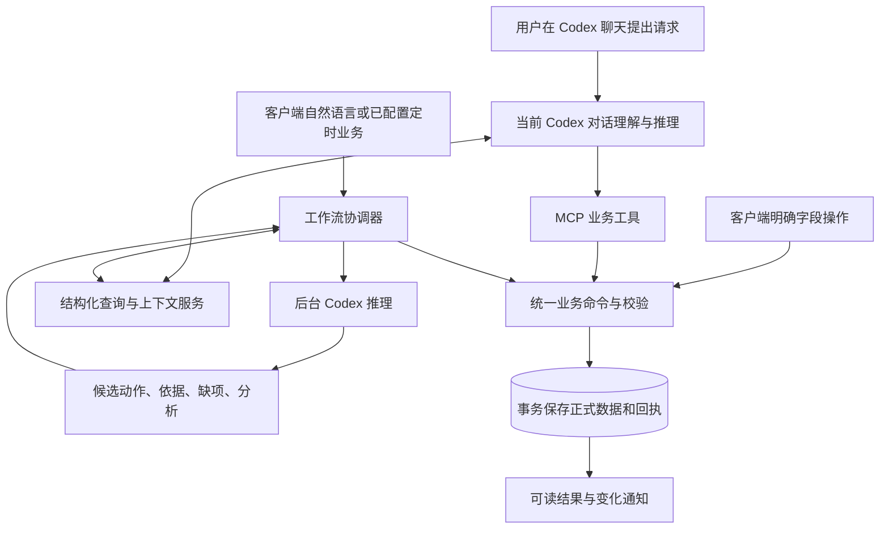

**核心业务层执行设计 · 2026-09-22 · v0.1**

本次实施范围已收敛为构建软件并交付空业务库，不迁移旧数据。本文历史业务示例用于定义功能，实际验证采用隔离的合成数据；完整建设边界与验收以 [实施前审查报告](./实施前审查报告_2026-09-22.md) 开头和第 7 节为准。

本日实施前审查后的补充以 [审查报告与修订方案](./实施前审查报告_2026-09-22.md) 为统一入口。尤其新增受控成果作业、资料包、研究采集/运行，以及既有局部调整策略的兼容要求。事实管理不生成脚本直接写库，与用户要求制作代码/文档成果的作业能力分开。

本说明回答核心问题：每项业务由程序还是 Codex 完成，模型收到什么、返回什么、谁写数据库，以及日常操作是否生成临时脚本。它细化 [技术实现与使用逻辑](./技术实现与使用逻辑_2026-09-16.md)，供用户核对预期；当前仍为设计，未开发应用、迁移数据或启用定时任务。

**建议采用的执行原则**

固定 Python 业务程序负责读取、计算、校验、提交和恢复。Codex 在自然语言理解、目标分解、计划取舍、复盘解释等环节参与推理，产生有结构的候选结果。正式数据由业务程序通过事务写入，再向界面或聊天返回真实回执。

日常事实管理调用预先开发、测试和版本管理的程序模块，不临时生成 Python/SQL 脚本来改数据库。程序模块本身可以用 Python 编写。用户明确要求生成文档、Notebook、代码或媒体成果时，受控成果作业可以在独立工作目录生产和验证产物，再通过标准接口登记版本；它也不直接写正式数据库。

第一版的智能每日计划仍由 Codex 提出任务选择、内容与时间块，程序计算可用窗口和检查约束。此阶段不假定已有一个能替代 Codex 做全部取舍的独立排程算法；旧系统的计划编译器也不能视作已实现的智能排程引擎。

**1. 核心由六组可扩展模块组成。**

| 模块 | 固定职责 | 何时使用 Codex |
|---|---|---|
| 信息接收与来源 | 保存用户输入、来源、报告时间、原文位置和附件引用 | 自由文本、图片/资料含义、对象匹配存在理解需求时 |
| 查询与上下文 | 查询对象、规则、依赖、相关历史、资料；返回版本和覆盖范围 | 理解模糊问题、提出补查范围、解释查询结果 |
| 工作流协调 | 决定步骤、管理草稿/待补信息/取消/重试和有效操作范围 | 在指定步骤调用推理执行器，不让模型自行定义保存协议 |
| 业务规则与计算 | 时间、周期、容量、冲突、依赖、统计、状态变化的确定性检查 | 需要语义判断的建议交给模型，并与规则结果分开 |
| 业务命令与存储 | 新建/更新/反馈/应用计划/规则变更；事务、来源、版本和回执 | 模型可提出命令或调用获准命令，不获得直接数据库写入路径 |
| 结果、调度与后台处理 | 持久输出、变化通知、定时触发、索引、导出、恢复 | 长报告叙述、复杂追问、分析和建议按需调用 |

数据主要分为：原始输入与证据、正式业务事实、用户规则、未应用候选、分析与输出、工作流与操作记录。存入数据库不等于成为事实；模型推测可以作为分析保存，但不能因此改变任务完成、提交或掌握等状态。

**2. 三种入口分别怎样运行。**



**客户端的明确操作。** 例如用户选中任务，勾选第 1—3 题完成：客户端提交对象和字段，程序校验后保存并更新显示。无需调用模型。如果字段缺失但允许未知，直接保留未知；不为填满表单而启动推理。

**用户在 Codex 聊天提出请求。** 当前对话已经是推理执行者。它通过 MCP 获取上下文、必要时补问、提出候选，再调用 `record_feedback`、`create_task`、`validate_plan_candidate`、`apply_changeset` 等业务工具。业务工具执行固定程序，不在内部再次启动后台 Codex。

**客户端自然语言或已配置后台业务。** 工作流协调器整理输入和上下文，通过 AI 执行器调用后台 Codex。后台推理实例只获得本业务需要的查询能力和候选输出能力；协调器收到结构化结果后，执行同一套业务命令。模型返回的流式文字可以显示为进行中的建议，不能作为已保存成功的回执。

每项工作流记录由哪个入口负责推理。`start_assisted_workflow` 属于客户端/调度器入口，不注册成模型可任意调用的业务工具；读写工具不会暗中发起新的推理。内部校验反馈后的修订属于同一工作流，受到次数、时间和范围限制。

如果用户只是查询，返回结果即可；若请求形成可接续计划、报告或草稿，保存对应输出对象；若请求执行变更，则取得提交回执后再说明哪些内容已生效。

**3. 后台究竟如何连接 Codex。**

建议第一条集成路线为：Python AI 适配器管理本地 Codex App Server，通过 STDIO 交换结构化消息，建立或恢复受控推理会话，发送当前任务与输出结构，接收结果和运行事件。模型运行可远程联网推理，“本地业务服务”不意味着大模型在本机离线运行。

App Server 官方提供 JSON 消息协议及 `turn/start.outputSchema`；MCP 则用于向现有 Codex 对话提供业务工具和结构化结果。它们的用途不同：前者由软件发起推理，后者由 Codex 调用软件功能。[App Server](https://learn.chatgpt.com/docs/app-server) · [MCP 工具及结果](https://developers.openai.com/plugins/build/mcp-server)

本轮在 2026-09-22 只读核对到本机 `codex-cli 0.155.0-alpha.9.2`，帮助中有 App Server STDIO 入口及非交互 `exec --output-schema`。后者可作为独立、单次推理的适配实现，但不是每次业务都临时拼脚本写库。第一轮原型优先验证一条固定运行路径，避免同一请求在多套执行器间重复启动。[非交互结构化输出](https://learn.chatgpt.com/docs/non-interactive-mode)

官方当前对 app-server 命令和 WebSocket 路径有实验性说明；STDIO 方案也必须实际验证启动、认证、工具权限、结果结构、中断和恢复。本轮没有启动模型会话或验证真实接入。若这一运行时不能满足所需隔离和稳定性，应在同一 AI 适配接口下更换实现，不改变业务保存协议。

信息理解/计划建议的后台执行环境只提供批准的业务读取及候选返回能力，不授予正式数据库文件写权限。单独注册的成果生产或运行作业可获得其任务工作目录内的工具能力和资源预算，但仍通过标准接口登记产物/结果。数据库和管理软件自身源代码都不作为日常业务模型的编辑目标。具体工具权限必须由运行配置和服务端权限共同限制并实际测试，不能只靠提示词中“不要写文件”。

**4. 给模型什么，模型交回什么。**

每类业务使用有版本的推理说明，具体描述目标、已有事实、可补查工具、禁止推断项和返回结构。说明是程序维护的模板；最新规则和事实从业务服务注入，不随长聊天越积越多。

| 输入项 | 内容 |
|---|---|
| 业务目标 | 信息整合、每日计划、周回顾等明确类型，以及本次用户请求 |
| 上下文快照 | 相关对象和版本、用户规则、完整硬约束、证据、覆盖范围 |
| 可执行范围 | 允许提出哪些动作、针对哪些对象/日期；只查询、形成草稿或可提交 |
| 输出约定 | 候选动作、来源、假设、缺项、解释和展示结果的字段结构 |
| 运行边界 | 可补查范围、取消状态、最大修订次数与超时处理 |

一个候选结果至少含：业务工作项编号、结果类型、相关对象、候选字段/动作、来源引用、尚未确定的信息、简明理由、依据的快照版本。结果类型区分“只读回答”“需要补充”“可校验候选”。不要求保存模型的内部思考过程。

合成例子：用户说“任务 T-EXAMPLE 的前三题完成，第四题卡住”。模型可返回以下候选数据，字段名称仅作契约示意：

```json
{
  "kind": "candidate",
  "actions": [{
    "operation": "record_feedback",
    "task_id": "T-EXAMPLE",
    "completed_items": ["q1", "q2", "q3"],
    "blocked_items": ["q4"],
    "actual_minutes": null,
    "source_ref": "input-example-01"
  }],
  "unknown_fields": ["actual_minutes", "mastery"],
  "clarifications": []
}
```

程序仍需检查这些题号是否确实属于该任务、用户原话指向哪个对象、反馈时间依据、先前状态和当前版本。可选未知字段不用一律补问；对象不明确或会改变结果的关键歧义才进入待补信息。

候选中的 SQL、Python 或任意代码不属于允许的操作类型。固定命令处理器才知道如何更新实际数据表；不同数据库或内部表结构变化不影响模型日常使用。

结构合法只证明结果符合数据格式。程序能检查引用存在、约束成立、范围和版本匹配，不能由此证明模型没有误解语义，也不能证明某项现实活动真的发生。用户报告、资料记录和模型判断保持不同证据身份；有冲突或关键歧义时保留原文并澄清。

模型自填 `authorized=true` 不能建立授权。界面按钮、已配置的后台策略、已有业务授权记录和当前明确请求用于确定操作范围。外部聊天无法取得宿主可验证的原始消息时，来源应注明为代理转录，服务不能宣称从一个 MCP 参数就验证了整段聊天真实性。资料中的指令文字不能扩大用户授权。

明确、无歧义且在有效范围内的普通操作可以自动提交；这套协议不要求每次录入后再问一次“是否确认”。

**5. 全量能力怎样分配。**

| 能力 | 固定程序/算法 | Codex 推理 | 保存或输出的边界 |
|---|---|---|---|
| 新信息获取与整合 | 保留原文、来源、时间，按类型校验，关联与去重 | 提取候选事实、识别对象、发现语义冲突 | 原始输入、待确认候选和正式事实分开 |
| 读取旧信息 | 精确查询、关系展开、文本检索、分页、版本和范围 | 理解问题、选择补查、解释关联 | 旧报告不覆盖新事实；摘要保留原文定位 |
| 个人资料与规则 | 生效日期、适用范围、临时例外和优先级 | 表达偏好、提出规则修改建议 | 一次低状态不自动成为永久规则 |
| 新任务/课程/项目/活动 | ID、领域字段、依赖、完成标准、里程碑和状态管理 | 目标分解、补全建议、优先级与阶段设计 | 用户给定信息与模型建议分别标识 |
| 日程与突发事件 | 周期展开、例外、冲突和影响集合 | 理解变化、提出局部取舍 | 事实可有冲突；新计划需处理冲突，不能拒收真实事件来维持表面合法 |
| 每日计划 | 硬安排、可用窗口、容量、依赖和准备检查、版本提交 | 选择任务、分解困难任务、给出时间块和理由 | 新计划与已执行记录分开；未安排项可保留 |
| 定时复核与执行反馈 | 定时触发、对照已有记录、生成待反馈项、去重 | 理解自由回答和阻塞，必要时整理追问 | 无回复不生成实际状态；时间已过不等于未完成 |
| 周/月/学期回顾 | 统计明确记录、保留未知量、对照计划、保存报告 | 分析原因、提炼经验、提出后续行动 | 分析不自动变事实；建议不自动改规则 |
| 准备与知识复习 | 准备窗口、复习周期、主题、证据和到期项 | 判断复习重点、策略、材料用途 | 看过、学过、掌握、提交分别保存 |
| 资料与缺口 | 文件登记、版本、索引、解析、来源定位、缺口和核查触发 | 摘要、解释、提取要求与关联任务 | 未发布、未获取、未阅读、访问受阻分别表示 |
| 业务草稿与结果接续 | 待决问题、方案版本、结果快照、操作编号和上下文 | 继续讨论、比较方案、生成可读输出 | 草稿不生效，历史输出与实时查询区分 |
| 历史与生命周期 | 审计、并发、撤销、恢复、导入导出、归档、跨学期结转 | 解释差异、提出恢复/结转范围 | 自动记录实际执行；外部投递和文件处理单独记状态 |

提醒和风险检测贯穿这些能力：日期、依赖、容量等可计算风险由程序产生；可能的原因和建议由模型补充。材料内容提取所需的 OCR/解析器属于独立处理组件，其结果也需区分原文、解析结果与解释。

**6. 新信息从输入到保存的完整过程。**

1. 接收用户主动提交的信息，保留原文/来源、报告时间和本次目标，创建或续接业务工作项。自动定时查询没有用户回复时，不制造一条虚构输入。
2. 界面明确字段可直接进入校验；自然语言由当前或后台 Codex 解析。读取服务提供候选对象、相关旧事实及其版本；模糊匹配不自动证明是同一对象。
3. 程序检查候选是否引用有效对象、字段是否合法、有无重复或冲突。来源相互矛盾时保留双方，不能默认“后读到的文本覆盖旧记录”。相对时间按输入时间和用户时区解释，缺锚点时保留未知。
4. 明确且可提交的部分由固定命令保存；有独立提交意义的确定事实不必被另一项待补问题阻塞。必须一起生效的关系变更则原子提交。
5. 数据库事务同时保存事实、来源关联、操作历史、去重回执和后续任务；提交后发布变化。提醒、资料索引等后台处理有独立状态。
6. 返回“已保存哪些、仍未知哪些、哪些未执行”的结果。修改偏好、安排新任务、重新排程必须符合当前请求范围，不因为识别到影响就自动全做。

**7. 每日计划的具体流程。**

触发条件是用户要求生成/调整计划，或已明确配置且适用的策略。既有习惯中“今天做什么合适”和明确低状态表达属于相应触发，无须二次确认。实质反馈允许按有来源和范围的局部调整策略修订受影响计划；定时复核本身不隐含每天自动生成新计划。

1. 程序读取日期和时区、固定课程/事件及例外、任务与依赖、截止、准备要求、近期反馈、个人容量与休息规则。历史记录不作为今天已完成的证据。
2. 程序展开当日硬安排，计算可用窗口和容量，列出缺资料/缺估时等问题。候选任务可以筛选和分页，但完整硬约束不能因上下文预算被静默截断。已知可能占用相关窗口但时段未明的事件不能被忽略并宣告全部硬约束通过：先安排不受影响部分，相关时段保留待定，或补全必要信息后再提交该时段的正式安排。
3. Codex 在这些窗口与约束中选择关键成果、任务和学习方式，提出结构化时间块、未安排项、假设及理由。建议估时与已测实际用时分开，不把估时写成执行事实。
4. 程序检查每个时间块的日期、长度、重叠、依赖、恢复/缓冲、准备要求及被保护的历史执行。规则违反时返回具体错误位置和原因。
5. 同一推理执行者可按错误修订，初始建议最多两次自动修订，仍不可行则返回未安排项或所需取舍，不无限循环或擅自削减硬约束。
6. 通过检查且在有效授权范围内，提交前重新核对依赖版本，程序保存计划新版本和回执，并生成界面/聊天都可读的结果。

“请给我两种方案比较”只保存/展示候选；“按这些条件生成今天的正式计划”可在条件满足时保存生效，不机械增加确认。约束无解、新增重大取舍或关键对象不明时，才提出具体补问。

首版的程序负责确定性的计算与校验；智能取舍仍依赖 Codex。后续若引入排程优化算法，可通过同一候选计划接口替换或辅助生成步骤，不改变保存和验收协议。

**8. 每日定时复核与周回顾的具体流程。**

每日复核：定时器按已配置的本地时间触发一次工作流 → 读取当天有效计划、各任务的完成门及已收到反馈 → 程序分类已确认完成/部分完成/明确未完成/未反馈 → 生成具体待反馈问题 → 投递到可用渠道并保存通知状态。

简单问题可由模板直接生成；复杂关联才由 Codex 整理。用户回答后，进入第 6 节的信息整合流程。没有日计划时，只询问已存在的临时任务或用户提供的事项；没有回复时保留待反馈，不生成完成、失败、用时或掌握事实。文件存在、提醒已读、电脑使用记录也不能自动代替完成证据。

提醒记录、复核报告、已送达状态和实际反馈是四类不同记录。语义上可确定“已过截止”的计算提示，不代表已经确认“没有做完”。是否主动唤醒指定 Codex 对话取决于真实通知渠道能力，不能将其作为数据正确性的前提。

周回顾：程序建立指定周的事实快照 → 统计计划、明确反馈、成果证据、投入记录和未知部分 → Codex 对照目标分析偏差、可能原因与建议 → 程序核对报告引用和数字 → 保存复盘结果并展示。

例如本周计划 6 项，其中 2 项确认完成、1 项部分完成、3 项待反馈，就展示这组分类；不能写成“剩余 4 项都未完成”。实际用时只统计有记录部分，并明确缺失覆盖。模型提出的原因标为分析或假设。

回顾建议中的新任务、优先级或规则改变，形成独立候选动作；只有当前请求或既定规则已授权执行时才应用。单纯“回顾一下”不自动改下周计划或永久作息。

**9. 新任务、新项目与突发事件。**

明确任务录入由程序直接完成。模糊目标如“准备某项展示”需要 Codex 帮助提出成果、阶段、子任务、依赖和验收标准；模型建议的截止或工作量需要明确标识，不能伪装成用户提供或官方要求。

新项目先保存最小项目身份、目标和已有信息，后续分解可作为项目草稿推进。多个任务必须一起建立才能构成有效依赖时，作为一个变更集提交；记录一个项目不要求一次性知道全部细节。

突发事件的事实登记与重排分开。例如用户报告“明天下午临时有活动”：先保存已知信息，具体时段未知时保持待确认；程序分析可能影响范围。只有用户要求处理安排或已有适用规则时，再让 Codex 提出局部调整，随后程序检查并提交。已完成的事项和历史反馈不被新计划改写。

如果用户同时要求“记录完成情况并把剩余部分安排到明天”，事实保存和计划提交是两个有回执的步骤。后一步失败不回滚已经真实报告的完成情况；最终结果分别列明反馈已保存、计划是否生效。

**10. 查询、保存和输出为何不需要临时脚本。**

程序提供稳定查询接口，支持对象 ID、日期区间、课程/项目、状态、关系展开以及资料检索。Codex 决定需要问什么，再调用这些接口；接口内部使用固定查询代码，不接受任意 SQL。结构化字段优先查询，正文按关键词/索引定位并返回原文片段，复杂语义检索可以作为后续扩展。

程序提供稳定写入命令，定义输入结构、可修改字段、来源要求、规则和事务边界。模型输出候选参数，程序执行已有处理器。保存完成后，模型和客户端收到同一份可验证回执；聊天中的“已完成”必须以这个回执为依据。

临时脚本可用于开发新模块、受控迁移、一次性转换、特殊分析，以及已授权成果作业中的生产步骤。学习代码/Notebook 本身也可能是用户要的产物。日常用户提出系统暂不支持的操作时，应说明能力缺口或保存需求，不能自动升级成修改管理软件或直接改正式数据库。生产/解析脚本仅在对应作业范围运行，其产物进入暂存、验证与标准登记流程，遵守来源、版本和资源要求。

原始数据、模型候选、已提交数据、可读报告都有各自身份。只读回答可直接展示；保存的报告是带时间和依据版本的输出快照；正式状态只能由成功的业务命令改变。

**11. 多轮、中断、定时任务与失败怎样处理。**

业务工作流状态至少区分：已接收、读取中、推理中、待补信息、待校验、可提交、已提交、部分步骤已提交、失败、取消。模型运行状态另存；模型回答结束、业务提交成功、通知送达不能混为同一状态。

- 换对话时按业务工作项读取已知信息、未决问题、有效范围和回执，避免重新猜测用户已经回答的内容。长期业务上下文不依赖一个无限增长的模型会话。
- 模型运行编号、业务请求编号和通知投递编号分别管理。模型超时先查已有回执，不通过重新生成新的请求重复执行；可查询操作状态后再决定重试。
- 自动重试和模型修订有界且可配置，区分网络失败、格式错误、业务冲突和需要用户补充。无权限、取消、额度不可用等情况不通过循环重试规避。
- 取消后到达的旧候选不再自动提交；已经提交的事实需要新的撤销/修正操作，不能声称取消推理就回滚了数据。
- 推理结束后复核所读依赖、规则及目标日期范围的版本。另一个对话新增硬事件也要触发冲突处理，不能只检查原来读取的几条记录。
- 定时器按数据空间、调度规则 ID 和本次预定触发实例去重，同时保存业务日期与时区。同一实例的重试/恢复只执行一次；午间与晚间等不同预定实例可以分别运行。休眠恢复后先查执行记录，再按预先配置的补查策略处理，避免连续补发一串过期询问。
- AI 不可用时，明确字段录入、查询、已有结果查看、规则检查和模板复核仍可运行；需要 AI 的计划取舍和解释明确显示未完成，不拿简化算法冒充同等分析。

**12. 扩展与验收。**

一项业务模块应注册：输入结构、查询上下文构造、可选推理任务说明、候选输出结构、规则校验、提交命令、结果展示、数据迁移及验收场景。客户端和 MCP 使用同一组业务定义；AI 执行器替换不会改变事实保存逻辑。

首批需要逐项演示并记录：明确字段操作零后台模型调用；当前 Codex 请求没有递归推理；后台候选不能直接写库；完整计划生成与无解退出；无回复复核不产生执行事实；周回顾保留未知分母；语义歧义进入补问；旧版本提交被拦截；超时重试不重复执行；事实已保存但重排失败被分别报告；新对话接续；客户端独立 AI 路径；新增一项业务扩展。

验证还要包含“结构正确但语义错误”的候选，确认系统没有把格式校验当作真实性保证。自动规则不能完全证明自然语言理解正确；保留来源、有限操作范围、必要澄清、可追溯结果和可恢复修改共同降低错误影响。

本轮设计分工已经明确，实际推理接入、业务算法、权限约束和这些验收仍未实施。功能覆盖参考既有阅读报告和能力清单；9 月 14 日读取的原系统业务规则属于历史依据，正式迁移和实现规则参数前仍需重新核验。
