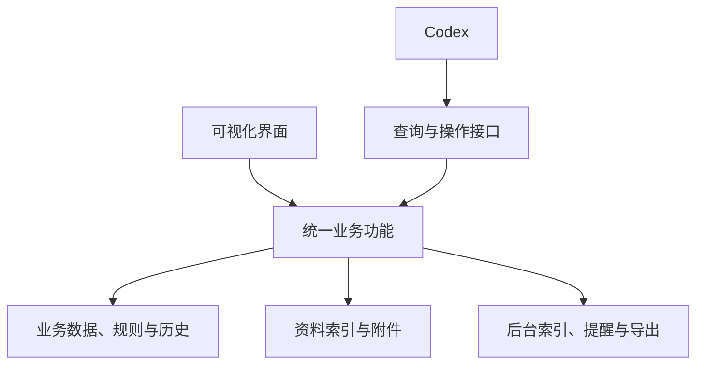

**个人管理系统软件化方向草案 · 2026-09-16 · v0.3**

2026-09-22 实施前审查补充：[统一审查与修订](./实施前审查报告_2026-09-22.md)、[历史场景覆盖](./历史场景覆盖矩阵_2026-09-22.md)、[层级与界面扩展](./数据层级与界面扩展规范_2026-09-22.md)、[资源与恢复](./资源预算与恢复规范_2026-09-22.md)。新增成果生产、可执行资料包、研究采集和运行作业的承接要求；本草案的功能分组不替代逐场景验收。

这份草案用于澄清产品方向。依据为本轮用户意图、已确认的使用方式，以及 [9 月 14 日项目阅读报告](./Y2S1_项目阅读报告.md)。本轮没有重新盘点 Y2S1 当前业务状态，没有修改原系统，也没有实施应用或数据迁移。

已明确的目标是：抽离具体文件内容，承接现有完整功能，保留 Codex 操作接口，使入口更清晰、运行更快、使用和迁移更方便。用户本轮进一步确认：**界面和 Codex 都能完成主要操作**。

后续补充：用户实际上不直接查看工作簿，认可现有功能设计，当前重点是技术实现和使用逻辑的可靠性。实现细节已整理到 [技术实现与使用逻辑](./技术实现与使用逻辑_2026-09-16.md)：建议把结构化事实迁入数据库，由共享业务服务负责规则、保存和历史，将工作簿变为可选导出。此处是设计建议，不代表已切换原系统事实源。

新增确定要求：业务接口可扩展；界面不采用 TypeScript 与 npm 前端构建流程；保留通过 Codex 聊天更新和查看的习惯；支持多对话、新对话及两端独立运行。技术说明已改用 Python + Qt 原生桌面界面作为候选，并加入持久业务工作项、变更订阅、版本检查和独立后台服务的设计。

以下功能组织、实现顺序与本地优先形态均为建议，具体框架和最终界面仍需原型验证。独立客户端必须覆盖主要管理操作；其 AI 能力需要可独立启动的模型执行接口，不应要求同时打开外部 Codex 聊天窗口。是否提供完整内嵌聊天布局仍待界面设计，不影响业务独立运行的要求。

可以先用这句话描述产品：

> 一个由可视化界面和 Codex 共同操作的个人事务管理软件，统一管理个人资料、目标、任务、日程、资料、计划与反馈；软件负责可靠保存和执行规则，Codex 帮助理解输入、分析情况和提出安排。

**把“剥离内容”落实为三类可以分别管理的东西。**

| 类别 | 包含什么 | 如何与软件分离 |
|---|---|---|
| 软件能力 | 录入、查询、计划、反馈、提醒、校验、历史、导入导出 | 程序和接口不写死某门课、某学期、某份文件或 D 盘路径 |
| 业务数据与个人设置 | 课程、项目、任务、事件、实际完成、生活约束、目标、偏好 | 持久保存为有类型、有稳定 ID 和版本的数据；下一学期建立新实例并承接长期对象 |
| 资料正文与附件 | 笔记、说明、PDF、图片、视频、源代码、成果 | 保留独立文档/附件；系统登记对象、来源、版本和关联关系，按需读取内容 |

业务事实仍需要内容支撑。任务是否完成、考试是哪天、规则从何而来，都应能返回原始反馈或资料位置。结构化字段之外也要允许长说明和笔记，不能强迫所有信息变成固定表格。

例如，IE2108 这个名称属于课程数据；“事件有日期、来源、确认状态”属于软件模型；“考试提前 14 天准备”属于可修改、有生效范围的个人规则；一份讲义属于与该课程关联的资料。四者不应在程序代码中粘在一起。

课程仍需要课程特有的考核、教学周和知识主题，研究项目也需要实验、运行记录和成果。建议用通用的任务/事件/项目基础加上领域字段与模板表达，先覆盖本人已存在的场景；暂不引入任意业务都能自行编程配置的复杂平台。

**双入口共享业务功能。**

两种入口调用同一套功能，完成后的结果和操作历史相互可见。界面直接完成常规录入、查询、修改与反馈；Codex 可以批量查询、理解自然语言、提出计划并调用同样的操作。需要 AI 推理的功能可以在界面中作为明确动作启动。

业务入口负责输入校验、来源记录、版本检查、原子保存、相关视图更新和审计。Codex 日常操作应通过这些入口完成。数据库布局、Excel 单元格和 Markdown 段落不应成为日常工具调用的必需知识。

已有 WORK、claim、检查点、CHG 的可靠性职责可分别由任务执行记录、并发控制、事务恢复和自动变更日志承担。功能迁移的验收单位是“能否可靠完成同一种业务动作”，无需机械保留每份控制文件的手工维护方式。

**全量能力清单是迁移的检查表。**

| 能力 | 软件中需要保留的行为 | 一种验收场景 |
|---|---|---|
| 个人资料与约束 | 长期目标、作息、精力、偏好与临时例外；保存来源和生效范围 | 本周减负到期后不会自动改成永久规则 |
| 课程、项目与活动 | 独立主页、领域字段、里程碑、成果、关联对象 | 同一任务可以关联项目与课程，实际状态只有一份 |
| 收件箱与新增信息 | 原话、待确认字段、分类、物化去向和去重 | “下周考试”先保留原话，缺日期时不生成确定日程 |
| 任务与依赖 | 下一步、完成标准、子项、截止、估时、精力与依赖 | 完成一部分题目不会误关整份复合任务 |
| 事件与固定安排 | 一次性节点、周期规则、例外、地点、时区和冲突 | 某天不上课不改变整个学期的固定周程 |
| 准备与复习 | 提前准备窗口、课前要求、知识主题、错题与复习证据 | 学习记录与掌握度分别维护，不据观看视频推断掌握 |
| 每日计划 | 硬节点、关键成果、时间块、低状态方案、恢复和缓冲 | 临时缩短可用时间后，保留已完成记录并解释后续调整 |
| 执行反馈 | 计划与实际分离，保存完成范围、证据、阻塞与精确结转 | 未报告用时保持未知，不填为 0 或估计值 |
| 材料与来源 | 导入/链接、全文与字段检索、版本、原件、衍生版和证据定位 | 找到任务使用的 PDF，并定位关联页或来源说明 |
| 资料缺口 | 缺失原因、实际核对范围、下次触发、证据冲突 | 未发布、未下载、未阅读和访问受阻能分别表示 |
| 风险与提醒 | 截止、依赖、容量与资料风险；可配置触发和运行状态 | 提醒触发失败可发现，无回复不自动产生完成事实 |
| 周期复盘 | 计划与实际差异、原因、投入、完成质量、规则调整 | 一条复盘决定能转成可追踪任务或规则变更 |
| 历史与恢复 | 操作者、来源、前后值、时间、版本、撤销与中断恢复 | 界面和 Codex 同时修改时检测冲突，不静默覆盖 |
| 迁移与归档 | 完整导出/恢复、跨学期结转、附件重连、保留历史引用 | 换一个目录恢复后，任务仍能找到其资料和证据 |
| Codex 操作接口 | 覆盖主要查询与写入，结构化返回结果与失败原因 | 同一反馈从界面或 Codex 输入，形成相同业务结果 |

“全量覆盖”可以分批交付。每一项能力最终都要有实现或明确的替代去向；第一轮先验证一个完整使用流程，避免同时铺开很多只有展示功能的页面。

**界面先按用户要做的事组织。**

建议先讨论五个主要入口，而不是照搬现有一级目录：

| 入口 | 打开后主要解决什么问题 |
|---|---|
| 今天 | 接下来做什么、有什么硬安排、哪里需要处理、怎样快速反馈 |
| 安排 | 查看日历与任务，调整优先级、时间、依赖和准备情况 |
| 项目与领域 | 查看课程、研究、创作、活动及长期目标的上下文与进展 |
| 资料 | 查找原件、笔记、版本、来源和关联任务 |
| 复盘 | 对照计划与实际，理解偏差，决定后续调整 |

快速捕获、搜索和 Codex 入口可在各页使用。个人设置、规则、数据导入导出和历史放在常用入口旁的管理区。以上只是信息组织草案，不代表页面数量或布局已经确定。

**通过一个例子验证分工。**

示例输入：“今天只做完了 Tutorial 的前 3 题，第 4 题卡住，明天下午有两小时。”这是演示内容，不是用户实际学习反馈。

1. 用户可以在界面选任务填写题号，也可以把这句话告诉 Codex。
2. 如任务身份明确，系统保存完成范围、卡点和反馈来源；用时、掌握度以及其他题目的状态保持未知。
3. 软件更新相关任务和今日视图；重复收到同一反馈时去重。有歧义时只针对影响记录的字段澄清。
4. 明天下午“两小时”先作为可用窗口约束；没有起止锚点时不虚构精确钟点。
5. 如用户要求调整计划，系统核对硬事件与依赖，给出受影响任务的修改建议、原因和剩余风险。
6. 应用变更后，界面和 Codex 读取相同版本；操作历史可以解释发生了什么并支持撤销。

明确的普通记录可以直接完成。按本轮重新核对的既有使用规则，实质反馈造成重复安排、前置/截止冲突或容量不可行等情况时，可以按有效局部调整策略处理；原缓冲可吸收则不重排。用户明确要求或已配置且有来源/范围的策略之外不扩大动作，也不默认每次小操作都需再次确认。

**速度目标落实到处理路径。**

| 操作 | 建议采用的处理路径 | 后续测量什么 |
|---|---|---|
| 打开今天、查任务、改普通字段 | 直接查询与写入结构化数据，更新受影响视图 | 界面反馈与保存耗时 |
| 保存一条执行反馈 | 一次业务提交处理关联更新、去重和审计 | 总耗时、重复提交、部分失败是否恢复 |
| 自然语言输入 | 按需提供相关上下文，Codex 解析后调用业务操作 | 模型时间、工具往返数、需要补问的次数 |
| 生成或修改计划 | 程序计算硬约束、容量和冲突，Codex 处理语义取舍与表达 | 建议生成时间、错误数量、修改影响范围 |
| 新资料入库 | 后台增量提取与索引，不阻塞普通录入 | 首次处理与后续查询分别计时 |
| 导出或大附件处理 | 后台任务显示进度、失败原因和可重试范围 | 可中断性、恢复正确性、前台是否仍可用 |

这改变了普通事务依赖模型的方式。数据库、缓存或换一个界面本身不能证明端到端提速；需要用相同场景比较旧系统与新系统，并分别记录程序处理、模型推理和文件处理耗时。具体时延指标在选定首批场景后再定。

**Codex 接入已有可评估的官方接口。**

截至 2026-09-16，官方文档支持 Codex 连接本地 STDIO 或 Streamable HTTP 的 MCP 服务。我们可以让软件提供查询任务、记录反馈、预览计划变更等业务工具，让现有 Codex 调用；这里是“软件向 Codex 提供工具”的方向。[官方 MCP 文档](https://learn.chatgpt.com/docs/extend/mcp?surface=cli)

若以后希望在软件内提供完整 Codex 聊天体验，官方 App Server 面向自定义客户端集成，涉及认证、会话历史、审批和流式事件。它与业务工具接口是不同层；可以后续在共享业务功能之上增加。[官方 App Server 文档](https://learn.chatgpt.com/docs/app-server)

以上只验证了官方接口用途，尚未实施连接、核验当前安装版本兼容性或测试本机端到端行为。此阶段无需先决定内嵌聊天，更不用修改现有 Codex 配置。

接口设计可先围绕“获取相关上下文、查询对象、记录反馈、更新任务、预览/应用计划差异、查找资料、查询历史”这些稳定业务动作。实际协议、方法名、授权和参数在后续设计时确定。上下文应带来源与版本；写入应返回真实结果，批量操作应报告每项成功、失败或待确认状态。

**可迁移性包含三个层面。**

- 换学期：新建学期和课程，继续使用长期目标、个人偏好、未完成项目及历史证据。
- 换目录或电脑：业务数据、规则、资料索引和必要附件可恢复；外置大附件可以重连，不能依赖固定盘符。
- 换操作入口或 AI：人工界面仍可进行主要管理操作，业务接口与数据不绑定一次聊天会话或某个模型。

建议将“完整恢复包”和“便于外部阅读的导出”都纳入设计。前者保证关系、版本与附件可恢复，后者便于查看和继续利用笔记、任务、日历等数据。可恢复性要通过实际导入验证，不能仅以导出文件存在作为成功标准。

**建议的推进顺序。**

1. 以这份全量能力清单为底稿，梳理日常真实场景、输入、结果和不可丢失的行为。先确定软件怎样帮用户完成事情。
2. 用少量具有代表性的数据做一个完整流程原型：记录任务或反馈 → 规则处理 → 今天/日历更新 → 历史可查；同一流程分别通过界面和 Codex 操作。
3. 核验体验与耗时后，逐块承接正式数据。每类数据明确唯一写入方；过渡期旧文件可作为只读参考或导出，避免长期自由双写。
4. 逐步补齐复杂排程、复习、资料处理、提醒、复盘和跨学期迁移，并用全量能力清单逐项验收。

本地优先、日常管理不依赖在线模型是当前可讨论的起点；跨设备同步、移动端、内嵌聊天与独立发布仍待明确。应用程序与用户数据分离，应从最初结构就保留。

具体业务接口、一次提交的处理方式、使用规则、首批场景和双入口验收已在技术说明中进一步展开。后续实现应围绕一条可实际使用并测量的完整业务链验证，具体界面容器和技术版本在该阶段核验。
